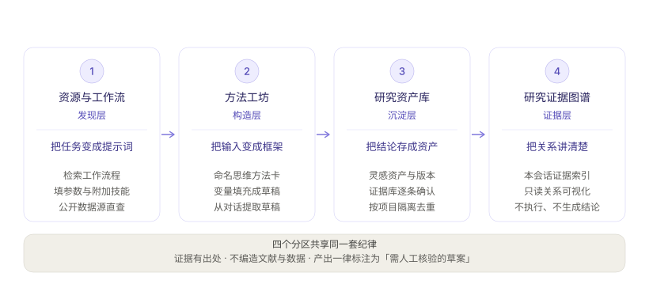

# DSH Research Kit

[](LICENSE)
[](https://github.com/fsrmqi/dsh-research-kit/actions/workflows/ci.yml)
[](https://github.com/topics/dsh-plugin)
[](https://nodejs.org)
[](https://dshhub.org/plugins/fsrmqi/dsh-research-kit)

[简体中文](README.md) · [English](README.en.md)

> 面向 DeepSeek Harness 的科研工作流目录与启动器：317 条人工审核的工作流、86 个技能条目、122 个科学数据源。

把反复执行的科研任务（审稿、写引言、做综述、设计分析计划）变成**参数化、可编辑、发送前可见**的提示词。插件只负责把任务组装好并交还当前会话，执行仍由你自己的 DSH Agent 完成。

---

## 前置：什么是 DSH

本项目是 [DeepSeek Harness](https://github.com/deepseek-ai/deepseek-harness)（命令行缩写 `dsh`）的插件。DSH 是 DeepSeek 开源的本地 Agent 工作系统，核心设计理念是「一切皆插件」（Everything is a Plugin）——模型、工具、界面、存储都由可替换的插件组成。

**没有 DSH，本插件无法运行。** 它不自带模型、不启动独立服务，只是在 DSH 的会话界面里增加科研入口。

| 需要什么 | 去哪拿 |
| --- | --- |
| DSH 本体 | [deepseek-ai/deepseek-harness](https://github.com/deepseek-ai/deepseek-harness) · [官方站点](https://deepseek.com/harness) |
| 插件生态 | [GitHub topic: dsh-plugin](https://github.com/topics/dsh-plugin) |
| Node.js | `>= 22.6` |

> DSH 目前处于 **Developer Preview**，官方明示会快速迭代、可能出现破坏性变更。本插件依赖的 `conversation.view` 槽位与 `inputActions` 契约随 DSH 版本演进——升级 DSH 后请按[手工验收清单](docs/MANUAL-QA.md)复验。

## 它解决什么问题

通用聊天输入适合临时提问，但不适合反复执行有明确步骤、材料要求与质量边界的科研任务。审稿、写引言、做综述、设计分析计划这类任务需要四件事：

1. **明确**的输入材料与输出范围；
2. **可复查**的执行步骤，而不是一句笼统指令；
3. **发送前**让研究者看见、编辑并确认任务说明；
4. 对「不编造文献 / 数据 / 结论」的**硬约束**。

Research Kit 把这四点做成可复用的资产。

## 它怎么工作

```text
科研能力目录（525 项）
  → 选择工作流
  → 填写参数、用 @文件 引用材料
  → 预览并编辑最终 Prompt
  → 写入输入框 或 发送到当前会话
  → 由当前 DSH 会话的 Agent 与其已配置工具执行
```


关键设计取舍：

- **不调模型、不存密钥**。执行完全交给当前会话；
- **不重造文件上传**。材料引用走 DSH 原生 `@文件`；
- **不假装已检索**。数据源条目如实标注接入前提，未接通时明确回退到 Agent/MCP。

## 能力一览

**🧪 317 条人工审核的科研工作流**
覆盖论文与手稿、文献研究、数据分析、基因组学、临床研究、神经科学、生态学、天文与空间科学等二十四个流程族（按分类分片维护于 `catalog/workflows/`）。每条都是参数化、可编辑的 Prompt 模板，内置防编造边界（不得虚构引用、数据、页码、作者意图）与「需人工核验」定位。

**🧩 86 个技能条目：23 个指导模块 + 63 个能力目录**
指导模块以提示词指导方式生效——科学写作、统计审查、引用核验、证据综合、可重复性检查、评审伦理与保密、数据完整性守护、不确定性表达，以及实验设计、假设生成、科学头脑风暴、科学批判性思维、样本量与统计功效、系统文献综述、科研图表、不确定度与单位、临床报告草案、投稿规范核验、同行评审意见、基金申请书撰写等方法模块，另有农业试验设计、作物基因组与育种证据、生信流程治理三个领域模块，勾选后并入工作流提示词；能力目录以「需宿主能力」状态如实收录 bulk RNA-seq、Nextflow、Benchling/DNAnexus 集成、文献 API 检索、docx/pdf 产出等依赖执行侧的技能——写明所需工具链、凭据与数据外发边界，附使用前提核验清单，不注入提示词、不代为执行。

**🔬 122 个科学数据源，其中 11 个支持插件直查**
文献、临床、遗传、组学、蛋白/化学，以及天文空间、生物多样性、气候环境、地理空间。公开 API 可直查并返回带链接与稳定标识符的候选记录；限流、需授权或需专业参数的来源会明确回退到 DSH Agent/MCP。

**✍️ 发送前完整可见、可编辑**
参数替换实时生成 Prompt 预览；手动编辑后参数变更不会静默改写正文，并提供「恢复自动生成」。必填参数缺失时不发送。

**🧭 一个视图，四个分区**
只有一个 `conversation.view` 标签，内部按科研闭环分区，顶部导航常驻并显示每个分区的定位与职责边界：

| 分区 | 层 | 作用 |
| --- | --- | --- |
| 资源与工作流 | 发现 | 目录检索、参数化组装、公开数据源直查 |
| 方法工坊 | 构造 | 方法卡 + 变量填充 → 可编辑 Prompt；可从当前对话提取草稿 |
| 研究资产库 | 沉淀 | 灵感资产增删改、版本对比、验证状态跟进；**证据库**子模块逐条保存公开来源的元数据与笔记，按项目隔离去重 |
| 研究证据图谱 | 证据 | 把本会话的资源、工作流、查询来源、资产、已保存证据与自动沉淀知识连成可追溯关系；支持缩放平移、迷你地图、聚焦/上下游/两点路径模式、结论追溯面板与脱敏快照导出；可开启「自动沉淀」随科研对话积累 |



**⏱ 组装回放：把 Prompt 是怎么拼出来的放给你看**
启动工作流后，工作台把 `composeWorkflow` 的**真实组装事实**逐段回放——工作流 → 参数 → 附加技能 → 数据源边界 → 人工核验；每一段都能在生成的 Prompt 文本中定位到对应锚点，回放与正文互相印证。详情栏内嵌紧凑回放，「弹出回放窗口」打开独立的 archify 交互 viewer（四种视觉预设、章节叙事、语义透镜、雷达总览）。回放只呈现**已经发生的组装动作**，不预测执行结果，也不代表 Agent 已执行任何工具；`prefers-reduced-motion` 时降级为静态。

<details>
<summary><strong>更多能力</strong>（点击展开）</summary>

- **科研模式任务预设** — 一键选择：**通用研究、文献与论文、生物信息学、作物遗传育种、临床与人群研究、数据分析与可视化**。每项会附加相应的技能组合与研究纪律（例如流程版本与质控留痕、农业试验和 G×E 边界、隐私与偏倚、统计前提与图表可解释性）；预设只是"指导组合"，不会自动执行任何工具。
- **输入框快捷入口** — 工具行的「资源 / 工作流程」按钮打开弹层选择器，无需离开当前聊天；选择工作流后经预览弹窗写入草稿，**从不自动发送**。
- **草稿增强器** — 输入框右侧一键增强：轻量档（零 Token 结构化整理）与语义档（复用当前会话模型、流式上屏、五维诊断、可取消），强度三档；增强后可撤销、可对比原稿。
- **收藏与使用历史** — 列表条目一键星标；成功写入/发送/复制自动记入历史（本地仅存 ID、名称、首行摘要与时间，最多 20 条）。
- **研究证据库** — 公开数据源查询结果可逐条「保存到证据库」，条目带稳定标识符（DOI / PMID / NCT / arXiv）与来源链接，默认「未核验」；按项目隔离去重，可导出 / 导入 JSON 与彻底删除。**只保存来源元数据与你写下的笔记，不保存全文与检索词；默认不自动入库——唯一例外是显式开启下述「自动沉淀」后，助手回答引用的来源会带「自动沉淀」标签以「未核验」状态入库。**
- **研究证据图谱** — 把本会话的资源、工作流、查询来源、灵感资产与**已保存证据**连成可追溯关系；证据节点只带来源库 / 稳定标识符 / 核验状态，**不展示笔记或检索词**；箭头表示关系方向，逆向关系按两端实际位置取锚点而非固定「左进右出」。确定性分层布局，支持 Ctrl / ⌘ 滚轮缩放、拖拽平移与复位，迷你地图快速跳转，聚焦 / 上游 / 下游 / 两点路径四种范围模式；可复制只含视图状态的链接，可导出脱敏 SVG / HTML 快照（导出前明确提示元数据范围）。
- **自动沉淀（默认关闭）** — 在图谱页显式开启后，每条助手回答完成时在**本地**提取研究问题、实体（基因/蛋白/性状/物种…）、发现、假设、方法与引用来源（中英文句式均支持），并生成关系（如「基因 → 可能影响 → 性状 ←研究对象— 物种」）；发现/假设/问题/方法进入灵感资产（待验证），引用来源进入证据库（未核验、带标签），知识与关系进入图谱并保留来源消息摘录；相同内容自动合并，冲突结论并列保留；全部以「待核验」起步、可逐条人工核验，点击图谱中的结论节点即可回看支持证据与聊天摘录；关闭后已保存内容全部保留。不开开关时也可在图谱页点「沉淀最近回答」，手动把当前会话最近一条助手回答提取入库。知识沉淀带 `project` 字段，图谱支持按项目与「本会话 / 持久沉淀」筛选节点，并可导出 / 恢复 JSON 备份。
- **研究结果解释图** — 目录内置「研究结果解释图生成」工作流：把研究结果整理成 diagram IR，再由 `scripts/render-diagrams.mjs --html` **确定性**产出单文件交互 HTML（可直接分享、离线打开），`--from-files` 可从会话产出文件生成 IR 脚手架；`scripts/validate-diagrams.mjs` 提供机器可读的规则诊断并已进入 `npm run check`（仓库内不预置 IR 文件，该校验在产出 / 审阅 IR 时生效）。
- **多种 Prompt 出口** — 写入输入框、发送到会话之外，还有「复制 Prompt」兜底：宿主动作缺失时也能把提示词带去任意会话。
- **启动前必填校验** — 预览弹窗内字段级错误提示（红框 + 说明）；缺失必填项不会写入草稿。
- **资源选择可管理** — 弹层底部实时显示已选资源 chip，可单个移除或清空。
- **手动编辑保护** — 手动编辑后变更参数/技能会提示不会自动合并；筛选后详情始终属于当前结果集。
- **宿主动作降级** — `setDraft`/`submit` 缺失时按钮禁用、灰化并说明原因，视图不崩溃。
- **深色主题与窄屏** — 跟随系统与 DSH 主题切换；880px 以下单列布局；原生 `aria-*` 与焦点环。

</details>

## 安装

要求 Node `>= 22.6`，以及提供 `conversation.view` / `conversation.input.left` / `conversation.input.overlay` / `conversation.input.right` 四个槽位的 DSH Web profile（依次为：统一视图、输入框左侧入口、浮层选择器、输入框右侧草稿增强器）。

**本地目录（当前推荐，尚未发布到 npm）**

```bash
git clone https://github.com/fsrmqi/dsh-research-kit.git
dsh plugin --profile web add ./dsh-research-kit
```

**GitHub（钉 commit，可复现安装）**

```bash
dsh plugin --profile web add github:fsrmqi/dsh-research-kit#<commit-sha>
```

**tarball（离线 / 审计）**

```bash
npm pack && dsh plugin --profile web add ./dsh-research-kit-0.1.0.tgz
```

> 构建产物 `ui/client.js` 已提交到仓库——克隆后即可安装，无需本地构建。

安装后刷新浏览器，在会话中打开「科研工作台」，或使用输入框旁的「资源 / 工作流程」入口。卸载或关闭视图不会残留重复注册。

**常见坑**：`dsh plugin` 会调用 PATH 上的 `pnpm`，其 store 布局主版本必须与目标 profile 记录一致，否则会以 `ERR_PNPM_UNEXPECTED_STORE` 失败。对照方式见[手工验收清单 §1](docs/MANUAL-QA.md)。

## 使用

有两条入口，通往同一套目录资产。

**方式一：科研工作台统一视图**

1. 在会话中打开「科研工作台」，默认落在「资源与工作流」，搜索或按类型筛选 525 项资源；
2. 选择工作流，查看目的、所需材料与使用限制；
3. 填写参数；需要材料的工作流请先在 DSH 输入框用 `@文件` 引用文件；
4. 按需勾选「附加技能指导」，预览实时更新；详情栏可展开**组装回放**，逐段核对 Prompt 是怎么拼出来的；
5. 点「写入输入框」保留再次编辑的机会，或「发送到当前会话」直接执行。

**方式二：输入框快捷入口**

1. 在输入框工具行点击「工作流程」或「资源」，在输入卡片上方的弹层中操作；
2. 「工作流程」面板：按场景筛选并选择流程，在预览弹窗中填写参数、检查 Prompt，点「使用工作流程」写入草稿；
3. 「资源」面板：在全部/数据库/技能之间勾选，勾选的技能作为附加指导、数据库作为研究提示并入之后启动的工作流；
4. 写入后用 DSH 原生回形针或 `@文件` 补充材料，再自行发送——快捷入口**只写草稿，从不自动发送**。

真实发送由 DSH 完成；本插件不创建模型路由、不保存密钥、不读取文件内容。

## 目录内容

工作流按流程族分片维护于 `catalog/workflows/`（每分类一个 JSON 分片，由 `index.js` 按固定顺序聚合）：

| 分类（分片） | 条数 |
| --- | --- |
| 论文与手稿（paper-manuscript） | 17 |
| 文献研究（literature） | 16 |
| 数据分析（data-analysis） | 18 |
| 研究设计（research-design） | 5 |
| 生物信息学（bioinformatics） | 18 |
| 基因组学（genomics） | 14 |
| 临床研究（clinical） | 19 |
| 作物遗传育种（crop-breeding） | 8 |
| 可视化与图表（visual） | 13 |
| 科研传播（science-communication） | 10 |
| 基金申请（grants） | 10 |
| 蛋白组与结构生物学（proteomics） | 13 |
| 细胞生物学（cell-biology） | 9 |
| 化学（chemistry） | 18 |
| 药物发现（drug-discovery） | 15 |
| 材料科学（materials） | 12 |
| 神经科学（neuroscience） | 12 |
| 生态学（ecology） | 14 |
| 物理学（physics） | 14 |
| 天文与空间科学（astronomy） | 11 |
| 社会科学（social-science） | 12 |
| 数学（mathematics） | 12 |
| 机器学习（machine-learning） | 15 |
| 工程学（engineering） | 12 |

另有 86 项技能（`catalog/skills/`：core 20 / crop-breeding 2 / bioinformatics 1 / host-capabilities 63）与 122 个数据源条目（`catalog/resources/`：crop-breeding 7 / literature 19 / genomics 8 / omics 7 / general-science 81）。完整定义见 [`catalog/`](catalog/)，数据契约见[架构文档 §4](docs/ARCHITECTURE.md)。

## 隐私与安全

| 访问 | 用途 | 说明 |
| --- | --- | --- |
| 当前会话输入框 | 仅在点击「写入/发送」时写入或提交最终 Prompt | 不拦截 Enter，不自动发送，不改动其他会话历史 |
| `@文件` 引用 | 只提示你使用 DSH 原生提及 | 不读取、不上传、不解析文件内容 |
| 浏览器本地 | 收藏、使用历史、方法卡与灵感资产（`localStorage`） | 不存参数值、完整 Prompt、文件内容；清除浏览器数据即清空 |
| 浏览器 IndexedDB | 证据库条目：来源元数据与你主动写下的笔记 | **仅在你逐条确认保存后**写入；不保存全文、检索词与原始响应；按项目隔离，可导出 / 导入 / 彻底删除。证据图谱只展示其中的来源库 / 标识符 / 核验状态，不展示笔记 |
| 当前页面内存 | 本会话证据索引（已启动工作流、直查来源摘要） | 仅供工作台各分区实时形成证据图谱；刷新或关闭页面即清空，不保存检索词、原始文件或完整结果 |
| 网络 | 公开数据源直查（仅在你主动触发时） | 出网经 DSH 受控 web 服务；插件不持有任何 API Key |

**零遥测。** 不上传使用统计，不采集数据。所有工作流产出一律标注为**需人工核验的草案**，不替代研究者、审稿人或伦理审批。

安全边界与漏洞上报方式见 [SECURITY.md](SECURITY.md)。

### 数据库查询

数据源详情页可直接查询首批公开来源：PubMed、Crossref、OpenAlex、Semantic Scholar、Europe PMC、ClinicalTrials.gov、openFDA、UniProt、PubChem、GBIF、iNaturalist——这 11 个来源在目录里标记为 `available-in-plugin`，详情页状态显示「插件可直接查询」。候选结果显示来源链接与稳定标识符，可写入输入框，或显式点击「让 Agent 核验并继续查询」——该按钮会调用当前 DSH 会话的 Agent，由它使用自己已拥有的 Web / MCP / 文件工具完成多步检索。

其余 111 个数据源标记为 `requires-mcp` 或 `reference-only`，会清楚提示所需的 MCP、订阅、API Key 或数据使用协议，并提供同一受控 Agent 回退。目录标注与查询实现由 `npm run check` 双向校验（有适配器就必须标出来，标了就必须有适配器），因此界面上的能力状态不会与实现漂移。**插件不会伪造任何检索结果。**

## 兼容性与状态

当前版本 `0.1.0`（尚未发布到 npm）。开发状态与下一步计划见 [ROADMAP.md](ROADMAP.md)。

已通过的验证：目录契约校验（525 项、525 唯一 ID，分片与聚合入口逐条一致）、219 项回归测试（24 个测试文件，含 6 项宿主动作缺失的渲染级降级断言）、真实 DSH Web profile 上的两轮启动烟测（快线 F1–F4、发布门槛 R1、观测项 O1–O3 全部通过），以及证据库写入 Prompt（W1–W3：勾选后按钮可用、未选择时不注入、写入不自动发送且条数一致）与证据图谱接入已保存证据（G1–G4：证据节点只带来源库 / 稳定标识符 / 核验状态，与同库资源连成关系，箭头按实际方向选锚点）的现场验收。

> 真实 profile 验收无法被单元测试替代——`test/dsh-slots.test.js` 虽然执行真实构建产物，但 slots 服务是模拟的。因此升级 DSH 后必须重跑[手工验收清单](docs/MANUAL-QA.md)。

## 开发

```bash
npm run build   # 生成 ui/client.js（提交产物，勿手改）
npm run check   # 目录契约校验 + 语法检查
npm test        # 纯逻辑、契约与渲染级回归测试（219 项 / 24 个测试文件）
npm run test:browser  # 真实 Chromium 交互回归（首次需 npx playwright install chromium）
```

改动 `catalog/`、`src/` 或 `dsh/` 后统一执行 `npm run build && npm run check && npm test`；CI 会校验构建产物与源码同步（构建后有 diff 即失败）。

## 文档

| 文档 | 内容 |
| --- | --- |
| [docs/README.md](docs/README.md) | **文档索引与推荐阅读顺序** |
| [架构与数据契约](docs/ARCHITECTURE.md) | 模块职责、数据流、DSH 宿主边界、目录 schema |
| [开发指南](docs/DEVELOPMENT.md) | 本地启动、实现顺序、测试策略、交付检查单 |
| [手工验收清单](docs/MANUAL-QA.md) | 为什么不能用单测替代、逐项验收步骤、失败定位树 |
| [方法工坊嵌入设计](docs/METHOD-WORKSHOP.md) | vendored 工件治理、命名空间纪律、构建器集成规则 |
| [范围与边界](docs/PRODUCT.md) | 要解决的问题、产品边界、质量与安全原则 |

## 参与贡献

欢迎 Issue 与 PR——见 [CONTRIBUTING.md](CONTRIBUTING.md)。新增工作流只需在 `catalog/workflows/<分类>.json` 分片中按现有条目结构添加 JSON 对象并运行 `npm run check && npm test`；契约校验器会强制检查占位符一致性与防编造边界，并断言分片与聚合入口逐条一致。

## 许可证

[MIT](LICENSE)。

随仓库分发的 vendored 工件的第三方归属与许可证声明见 [NOTICE](NOTICE)。
