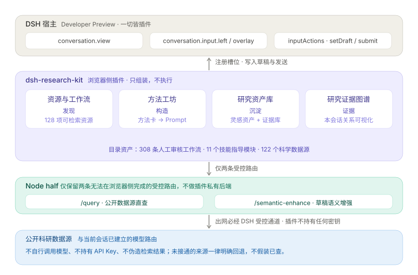
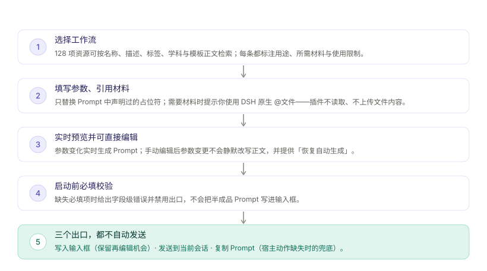
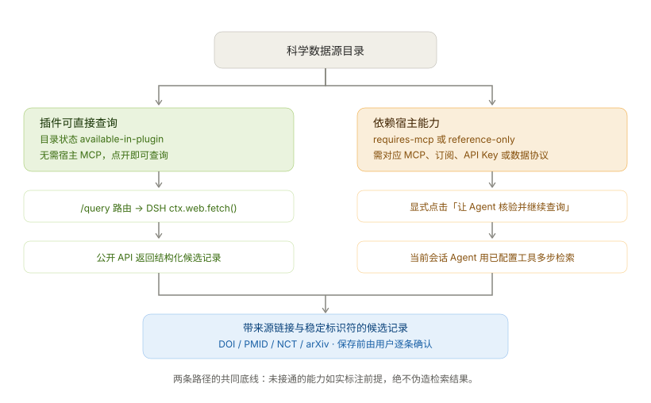

# 架构与数据契约

本文是 `dsh-research-kit` 的架构参考：模块职责、运行时数据流、DSH 宿主边界、目录数据契约与扩展点。需要改动代码或新增资产时以此为准。

文档索引见 [`README.md`](README.md)；手工验收方式见 [`MANUAL-QA.md`](MANUAL-QA.md)；方法工坊与草稿增强器的嵌入细节见 [`METHOD-WORKSHOP.md`](METHOD-WORKSHOP.md)。

## 1. 架构决策

### 1.1 一句话架构

`dsh-research-kit` 是一个 **浏览器侧 DSH 插件**：它维护科研资源目录、把工作流和用户参数组装成可编辑 Prompt，并由 DSH 当前会话负责实际发送与执行。

```text
┌────────────────────────────────────────────────────────────────────┐
│                          DSH 宿主                                   │
│  conversation.view        conversation.input.*    inputActions      │
│  （视图槽位）              （左入口/浮层/右增强）   setDraft / submit │
└───────▲───────────────────────────▲───────────────────▲────────────┘
        │                           │                   │
  注册统一视图                 注册输入槽位        写入 / 发送最终 Prompt
        │                           │                   │
┌───────┴───────────────────────────┴───────────────────┴────────────┐
│                   DSH Research Kit（浏览器侧）                       │
│                                                                     │
│  ResearchConsole（统一容器 + 两级吸顶）                              │
│    ├─ ①「资源与工作流」 catalog.js ──► catalog/*/index.js           │
│    ├─ ②「方法工坊」     vendored 工件 + prompt-studio-glue          │
│    ├─ ③「研究资产库」   research-vault.js ◄─► vault-core.js         │
│    └─ ④「研究证据图谱」 evidence-store.js ◄─► evidence-graph-core   │
│                                                                     │
│  所有分区共享同一出口：setDraft() / submit()，缺失时降级为复制 Prompt │
└───────▲─────────────────────────────────────────────────────────────┘
        │  仅四条受控路由（index.js，Node half）
        │  /query（公开数据源直查，经 ctx.web.fetch） · /semantic-enhance*（草稿增强）
        │  /host-capabilities（装配与 MCP 连接事实） · /memory-search（Memory Center 检索）
└───────┴──── DSH 受控 web 服务 / 当前会话模型路由
```



### 1.2 不引入独立后端的原因

第一期不需要沙箱、数据库代理或任务队列。它们会重复 DSH 已经承担的能力，并带来权限、保密、成本和状态同步问题。

**例外：Node half 只保留四条无法在浏览器侧完成的受控路由**（`index.js`，见 §2.1）：

1. `/dsh-research-kit/query` —— 公开数据源直查。浏览器无法直接跨域访问这些 API，且需要进程内缓存与限流；出网一律经 DSH `ctx.web.fetch()`，插件自身不持有凭据。
2. `/dsh-research-kit/semantic-enhance`（含 `/stream`）—— 草稿语义增强。复用当前会话已建立的模型路由（`sessionId → provider/model`），不持有任何 API Key。
3. `/dsh-research-kit/host-capabilities` —— 宿主能力探测（ROADMAP §6）。从工具注册表解析 `mcp__<server>__<tool>` 得到「已连接 MCP 服务器」事实，并报告 Web/Shell/文件系统/模型路由装配事实；只读、无副作用、不改写目录标注。
4. `/dsh-research-kit/memory-search` —— Memory Center 项目记忆检索（ROADMAP §5）。按已连接 MCP 的工具 Schema 合成参数后代为执行 `mcp__` 前缀检索工具；无法可靠合成参数时明确拒绝。结果只作增强候选上下文，是否注入由用户在面板显式勾选。

四条都不构成"插件自己的后端"：无独立进程状态可持久化、无凭据、无模型选择权，宿主卸载插件后不残留。除此之外的一切仍在浏览器侧完成。

| 能力 | 所有者 | 本插件职责 |
| --- | --- | --- |
| 模型路由与调用 | DSH | 不读取密钥，不自行调用模型。 |
| 当前对话与发送 | DSH | 通过 `inputActions` 写入或提交。 |
| 文件、`@` 提及与文件内容注入 | DSH | 只在 UI 中提示用户使用原生能力。 |
| MCP、Web、数据库工具 | DSH / 已安装插件 | 只如实标注工作流的接入前提。 |
| 工作流资产与 Prompt 组装 | Research Kit | 维护 JSON 目录、表单、校验与预览。 |
| 科研结论的责任 | 研究者 | 产物必须标为草案/待核验，不自动升级为事实。 |

### 1.3 已知宿主兼容性原则

同级 `dsh-promptkit` 已验证 DSH 的 `conversation.view` 与 `inputActions` 集成方式，但 DSH 的槽位 props 曾在版本间演变。因此：

- 首次接入必须在真实 DSH profile 启动验证，而不是只依赖单元测试；
- 所有访问 `inputActions` 的代码必须允许其暂时不存在，展示可理解的错误，不得使视图崩溃；
- 仅在用户点击“发送到当前会话”时调用 `submit()`；
- 不截获 Enter，不改变原生输入框行为；
- 不重新实现 `@文件` 自动补全、上传或文件解析。

## 2. 目录与模块职责

```text
dsh-research-kit/
├── catalog/                         # 人工审核的科研资产，纯数据；三个 index.js 是唯一数据入口
│   ├── workflows/                   # 参数化 Prompt 工作流，按流程族分片（317 条 / 24 个类目）
│   │   ├── index.js                 # 唯一聚合入口：按固定顺序导出数组，新增分片必须在此登记
│   │   └── <流程族>.json            # 每个分类一个分片（paper-manuscript、genomics、ecology…）
│   ├── skills/                      # 技能，按稳定用途分片（core / crop-breeding / bioinformatics / host-capabilities，共 86 条）
│   ├── resources/                   # 数据源，按稳定用途分片（crop-breeding / literature / genomics / omics / general-science，共 122 条）
│   │   ├── index.js                 # 唯一聚合入口，并导出 database-metadata.json 的分组展示元数据
│   │   └── database-metadata.json   # 数据源分组等展示元数据（对象型配置，不是条目分片）
├── src/
│   ├── catalog.js                   # 资源读取、搜索、查询、Prompt 组装（纯函数）
│   ├── catalog-storage.js           # 收藏与使用历史的 CatalogStorage 接口
│   ├── research-selection-store.js  # 会话级资源选择（仅存于当前会话）
│   ├── evidence-store.js            # 本会话证据索引（只读汇总）
│   ├── evidence-vault-store.js      # 证据库持久化：IndexedDB schema v2（entries + 资产-证据 link 表，守卫式升级）+ 内存降级 + 项目隔离 / 去重 / 备份
│   ├── knowledge-store.js           # 自动沉淀知识库持久化：节点/关系双 store，稳定 id 去重合并、冲突并列（IndexedDB + 内存降级）
│   ├── knowledge-deposition.js      # 自动沉淀编排：开关、assistant/message 事件接线、水位线、联动灵感资产与证据库
│   ├── theme.js                     # 视觉令牌单一真源（--rk-* 明暗双源 + 交互反馈）
│   ├── ui.js                        # 统一基础组件层（按钮/卡片/输入/标签/空态/弹窗…）
│   ├── catalog-category-filter.js   # 工作台与弹层共用的分类筛选组件（快捷分类与颜色集中在此）
│   ├── research-console.js          # 统一视图容器：分区调度 + 两级吸顶偏移实测
│   ├── research-workbench.js        # 分区①「资源与工作流」：目录检索 + Prompt 组装 + 内嵌组装回放
│   ├── route-replay.js              # 组装回放：trace 分段、引用块预览、独立 viewer 弹窗（§3.2）
│   ├── research-vault.js            # 分区③「研究资产库」：灵感资产增删改 / 版本 / 验证状态 + 证据库子模块切换
│   ├── research-evidence-vault.js   # 证据库面板（项目切换 / 删除 / 导入导出）与保存表单
│   ├── research-evidence-graph.js   # 分区④「研究证据图谱」：关系图渲染（缩放平移/迷你地图/范围模式/导出）+ 已保存证据接入 + 方向性锚点 + 自动沉淀开关与结论追溯面板
│   ├── database-query-panel.js      # 公开数据源直查面板（工作台详情内嵌）
│   ├── composer-launcher.js         # 输入框工具行「资源/工作流程」入口
│   ├── composer-overlay.js          # 输入框 overlay 资源选择器与启动弹窗
│   ├── composer-deposit-button.js   # 手动沉淀伴生钮：贴靠增强器浮动按钮、位置解算（纯函数）与临时状态条
│   ├── host-capabilities-client.js  # 宿主能力摘要：事实汇总（纯函数）+ 进程级 5 分钟缓存取数
│   └── lib/
│       ├── icons.js                 # 图标 path
│       ├── enhance-output.js        # 模型输出协议解析（Node half 与浏览器共用）
│       ├── vault-core.js            # 灵感资产纯逻辑与隐私边界
│       ├── knowledge-extract.js     # 自动沉淀结构化提取器（纯逻辑）：知识节点/关系/引用来源，确定性与有界性契约
│       ├── evidence-graph-core.js   # 证据图谱节点与边纯逻辑（含已保存证据与自动沉淀知识接入）
│       ├── evidence-vault-core.js   # 证据条目纯逻辑：标识符识别、规范化、隐私校验、去重键、备份格式
│       ├── asset-evidence-links.js  # 资产-证据互链纯逻辑：稳定 link id、候选推导（项目/标签/知识链种子）、图谱边转换
│       ├── console-sections.js      # 统一容器的分区契约（名称/定位/用途/边界/独占数据）
│       ├── overlay-anchor.js        # 输入卡片浮层的锚定与可用高度解算（纯函数）
│       └── archify-adapter.js       # IR / trace → archify data-* 契约 + 哨兵槽位替换（纯函数，衔接 vendor/archify）
├── dsh/
│   ├── standalone-glue.js           # DSH 槽位注册唯一入口（view + input.left + input.overlay + input.right）
│   ├── slot-registry.js             # 四个槽位的 id/order/label 单一事实源（纯数据）
│   ├── prompt-studio-glue.js        # 分区②「方法工坊」宿主与 provider 实例化
│   ├── prompt-enhancer-glue.js      # 草稿增强器宿主：研究上下文桥接 + SSE 客户端
│   ├── database-query.js            # 公开数据源直查适配器、缓存与限流（Node half）
│   ├── semantic-enhance.js          # 语义增强 system 指令与两条路由（Node half）
│   ├── host-capabilities.js         # 宿主能力探测：装配事实 + MCP 连接清单（Node half，只读）
│   └── memory-search.js             # Memory Center 检索：工具挑选、Schema 参数合成、代执行 mcp__ 工具（Node half）
├── ui/
│   ├── package.json                 # 浏览器子包元数据
│   └── client.js                    # 构建生成的 DSH ModuleLoader 产物（勿手改）
├── vendor/
│   ├── promptkit-embed.js           # vendored 界面工件（SHA-256 锁定，勿手改）
│   ├── archify/
│   │   ├── template.html            # vendored 交互 viewer 模板（SHA-256 锁定；整段注入为全局字符串）
│   │   ├── i18n.mjs                 # vendored viewer 文案（SHA-256 锁定；ESM 源码，参与 strip 与拼接）
│   │   └── LICENSE                  # 上游许可证原文
│   └── vendor-manifest.json         # 工件来源 commit 与校验和清单（当前 3 个工件）
├── scripts/
│   ├── build-client.mjs             # 内联目录数据并生成浏览器产物（含符号顺序与顶层重名断言）
│   ├── check-vendor.mjs             # 校验 vendored 工件未被篡改
│   ├── validate-catalog*.mjs        # 目录契约校验（CLI 与测试共用纯逻辑库）
│   ├── render-diagrams.mjs          # diagram IR → 单文件交互 HTML（--html）；结果文件 → IR 脚手架（--from-files）
│   ├── validate-diagrams.mjs        # diagram IR 诊断（规则码 + supportedFixes），--repo 已入 npm run check
│   └── browser-regression.cjs       # 真实 Chromium 交互回归（npm run test:browser）
├── test/                            # 242 项测试（28 个测试文件 + helpers 下的 IndexedDB 与 DOM 桩：纯逻辑 + 渲染级降级断言 + 源码/产物文本断言）
├── docs/                            # 读者文档，索引见 docs/README.md
├── index.js                         # Node half：仅注册受控路由
├── package.json
└── cordis.patch.yml                 # DSH bundle 注册补丁
```

> 本树是**受控清单**：新增模块、脚本或 vendored 工件必须同步登记本节。它与「新增源码模块登记两处」是同一条纪律的三个落点——本树（人读）/ `scripts/build-client.mjs` 的 `files`（产物）/ `package.json` 的 `check`（单文件语法）。目录分片只按目录粒度登记，不逐条列出资源。

### 2.1 分层规则

| 层 | 可以做什么 | 不可以做什么 |
| --- | --- | --- |
| `catalog/` | 声明研究流程、文本、字段、关联、限制 | 放可执行 JS、密钥、未核验结论。 |
| `src/catalog.js` | 纯函数、数据校验、搜索、Prompt 组装 | 访问 DOM、网络、`localStorage`。 |
| `src/catalog-storage.js` | 收藏/历史读写、变更通知，隔离 localStorage | 存参数值或完整 Prompt；网络访问。 |
| `src/research-selection-store.js` | 会话级资源选择的读写与广播 | 跨会话持久化。 |
| `src/evidence-store.js` | 在当前页面内存中汇总本会话已选资源、已启动工作流与直查来源的**索引**，并向各视图实时广播 | 执行查询、持久化、保存原始文件或检索词、生成结论。 |
| `src/evidence-vault-store.js` | 证据库持久化：IndexedDB schema v2（条目 + 资产-证据 link 表，守卫式升级）、按项目隔离与去重、备份序列化，并提供内存降级；link 的建立/解除/端点删除联动 | 触碰 DOM；在降级时伪装成已持久化；保存未经用户确认的条目或自动建立 link。 |
| `src/lib/asset-evidence-links.js` | 资产-证据互链纯逻辑：稳定 link id、候选推导（同项目 / 共同标签 / 知识链种子）、图谱边转换 | 自动建立 link；把候选当成已确认事实；在候选里携带笔记或全文。 |
| `src/knowledge-store.js` | 自动沉淀知识库持久化：节点/关系双 store、稳定 id 去重合并、冲突并列保留，并提供内存降级 | 触碰 DOM；在降级时伪装成已持久化；改写用户推进过的核验状态。 |
| `src/knowledge-deposition.js` | 自动沉淀编排：读写开关与处理水位线、**增量扫描** DSH 会话事件流（`sessions.binding().eventSource`，每次通知只扫上次扫过的尾部之后的新增段）、调用提取器并联动三个库；另提供手动沉淀入口（沉淀当前会话最近一条回答，图谱页与增强器伴生钮共用） | 在开关关闭时自动提取内容；发送任何网络请求；回放开关关闭期间的历史消息；让沉淀失败冒泡到宿主。 |
| `src/lib/knowledge-extract.js` | 规则化结构提取：知识节点/关系/引用来源，确定性与有界性输出 | 访问 DOM、网络或存储；把无法核验的提取结果标为已核验。 |
| `src/theme.js` | 主题 CSS 变量与 GlobalStyle 注入 | 读取宿主私有主题 API。 |
| `src/ui.js` | 无业务状态的基础组件与图标 | 持有业务逻辑或读取目录数据。 |
| `src/research-console.js` | 分区调度、分区导航、两级吸顶偏移实测 | 持有任何分区的业务逻辑，或读写分区的数据。 |
| `src/research-workbench.js` / `research-vault.js` / `research-evidence-graph.js` / `research-evidence-vault.js` | React 状态、渲染、调用注入的宿主动作 | 直接依赖 DSH 私有全局或发网络请求。 |
| `src/lib/*` | 与 DOM 解耦的纯逻辑（协议解析、布局解算、隐私边界、稳定性标识符识别、备份格式、分区契约） | 触碰 DOM 或宿主 API。 |
| `src/route-replay.js` / `src/lib/archify-adapter.js` | 把 `composeWorkflow` 的 `trace` 渲染为可核对的组装回放（详情内嵌 + 独立 viewer 窗口）；IR / trace → archify `data-*` 契约与哨兵槽位替换 | 预测执行结果；改写 vendored 模板；把回放当作执行证据。 |
| `src/composer-launcher.js` / `composer-overlay.js` | 输入框入口、overlay 选择器、启动弹窗 | 绕过 `inputActions` 直接发送或读取文件。 |
| `dsh/standalone-glue.js` | 将 DSH props 映射为组件 props、注册槽位（返回统一释放函数） | 处理领域业务、拼 Prompt。 |
| `dsh/slot-registry.js` | 槽位 id / order / label 的纯数据声明 | 执行注册本身。 |
| `dsh/prompt-studio-glue.js` / `prompt-enhancer-glue.js` | 为 vendored 组件与增强器提供宿主装配 | 修改 vendored 工件本身。 |
| `dsh/database-query.js` / `semantic-enhance.js` / `host-capabilities.js` / `memory-search.js` | Node half 的四条受控路由 | 持久化状态、持有凭据、自行选择模型、代执行 `mcp__` 前缀之外的原生工具。 |
| `vendor/` | 存放经审查、SHA 锁定的工件快照 | 手工编辑；运行时从相邻目录加载。 |
| `ui/client.js` | 仅为构建产物 | 手工编辑。 |
| `index.js` | 保持插件 Node half 可被加载；仅注册 §1.2 的两条受控路由 | 持久化状态、持有凭据、自行选择模型或注册未经需求确认的路由。 |

### 2.2 统一视图的分区契约

三个并列视图（科研工作台 / 研究方法工坊 / 研究灵感库——后者即今天的「研究资产库」）已合并为单一 `conversation.view`（`dsh-research-kit-console`），内部按「发现 → 构造 → 沉淀 → 证据」的科研闭环做四个二级分区。证据图谱是 Research Kit 自有分区，汇总本会话资源、工作流、查询来源、资产与**已保存证据**的关系；其余三个分区组件继续以 `embedded` 模式复用。

| 分区 | 定位 | 核心用途 | 职责边界 | 独占数据 |
| --- | --- | --- | --- | --- |
| 资源与工作流 | 发现层 | 目录检索、按参数与技能组装 Prompt、公开数据源直查 | 不生产知识、不沉淀资产、不直接出网 | 目录收藏与使用历史 |
| 方法工坊 | 构造层 | 方法卡库、变量填充生成可编辑 Prompt、从当前对话提取草稿并写回输入框 | 不管理资产正文、不检索项目记忆或最近会话、不替工作流决定领域参数 | 方法卡与工坊资产 |
| 研究资产库（含「灵感资产 / 证据库」子模块） | 沉淀层 | 灵感资产增删改、版本派生与对比、验证状态跟进；证据库逐条保存来源元数据与笔记、按项目隔离与去重、导出导入与彻底删除 | 不生成 Prompt、不存原始数据与完整查询结果、不静默注入；「不自动入库」的唯一例外是显式开启的自动沉淀（见 §3.6）——入库条目一律带「自动沉淀」标签且保持未核验/待验证 | 灵感资产（PromptKit asset provider）；证据条目（IndexedDB `dsh-research-kit-evidence`） |
| 研究证据图谱 | 证据层 | 可视化本会话已选资源、已启动工作流、直查来源、资产、已保存证据与自动沉淀知识之间的关系（节点与边见 §3.5）；承载自动沉淀开关与结论追溯面板 | 不执行查询、不生成结论、不保存原始文件与检索词；对证据库只读接入，不写入、不携带笔记与全文 | 本会话证据索引（`evidence-store`）；自动沉淀知识库（IndexedDB `dsh-research-kit-knowledge`）；对证据库只读 |

契约由 `src/lib/console-sections.js` 声明、`test/research-console.test.js` 守护：

- 每个分区必须声明名称、定位、核心用途、职责边界与独占数据五项；
- 职责边界必须显式包含否定项（"不做什么"），数据归属必须互斥，避免合并后功能重叠；
- 分区 id 必须与 `src/research-console.js` 的组件映射表一一对应，不允许出现"有导航无内容"的空分区。

合并过渡期的「原「旧标签」」提示徽标已移除：三个分区的旧位置映射在合并后已稳定，徽标只是常驻噪声，且它会随窗口变窄折行、反过来改变导航高度（而导航高度正是二级吸顶的偏移量来源）。因此 `formerLabel` 一并不再作为契约字段保留，避免留下无消费方的死数据。

**分区宽度一致性**：四个分区必须铺满内容区，水平内边距统一引用流式令牌 `--rk-gutter: clamp(16px, 3vw, 34px)`（`src/theme.js` 唯一定义处，容器导航条与四个分区五处共同消费）：视口 ≥1133px 时取上限 34px（与既有视觉刻度一致），其间随窗口线性收缩，880px 以下由媒体查询锁定 16px。宽度方向一律用 `100%` 相对父容器解算，不得出现固定像素宽度。方法工坊复用 vendored `PromptStudio`，其根 `<main>` 内联了 `width: min(1240px, max(100%, calc(100vw - 280px)))` 与 `margin: 0 auto`——这是「独立插件页 + 为宿主侧栏预留 280px」场景的写法。嵌入统一容器后父容器已是扣除侧栏后的可视区，叠加该上限会使本分区收成居中窄栏（宽屏留白、窄容器横向溢出），与另外三个铺满分区视觉割裂。

vendor 为 SHA 锁定工件不可改，因此由 `dsh/prompt-studio-glue.js` 的宿主包装提供锚点 `.rk-studio-host`，`src/theme.js` 以 author 级 `!important` 规则覆盖内联宽度（内联声明非 `!important` 时可被覆盖），只解绑宽度、内边距与 `overflow`，不改动组件其他样式。真实 Chromium 实测（视口 1280px）：

| 父容器宽 | 解绑前 main 宽 | 解绑后 main 宽 |
| --- | --- | --- |
| 1440px | 1240px（左右各留白 100px） | 1440px（铺满） |
| 900px | 1000px（横向溢出 100px） | 900px（贴合） |

流式令牌四档视口实测（方法工坊分区，`--rk-gutter` 解算值）：

| 视口宽 | `--rk-gutter` 解算值 | main 宽 | 横向溢出 |
| --- | --- | --- | --- |
| 600px | 16px（媒体查询锁定） | 铺满 | 无 |
| 880px | 16px（媒体查询锁定） | 铺满 | 无 |
| 1000px | 30px（3vw） | 铺满 | 无 |
| 1440px | 34px（上限） | 铺满 | 无 |

契约由 `test/research-console.test.js` 守护：vendor 宽度写法漂移检测 + 宿主锚点存在 + 覆盖规则齐备（宽度 / 居中边距 / `overflow`）+ 流式令牌定义（上下限与视口项）+ 四分区内边距同刻度。

其中 `overflow` 解绑是吸顶生效的前提，原因见 §2.3：`S.page` 里的 `overflow: auto` 会在嵌入场景下变成一个不再滚动的内层滚动盒，把 `<main>` 内所有 `position: sticky` 的参照系锁死在它自己身上。

### 2.3 顶部吸顶分层

统一视图的可滚动内容很长（分区①详情栏、分区③资产列表都能把页面撑到数千像素），而检索、筛选与模式切换是复用频率最高的动作。顶部因此采用**两层吸顶 + 一条分层原则**，而不是把所有头部一把吸住：

> **吸顶只放「随时要用的操作」，不放「读一次就够的内容」。**

| 层级 | 元素 | 是否吸顶 | 理由 |
| --- | --- | --- | --- |
| 一级 | `.rk-console-nav`（分区导航 + 说明块） | 是 | 回答"我在哪个分区"，跨分区切换不应需要回滚 |
| — | 分区封面 `PageHead`（kicker / 标题 / 导语 / 低频动作） | 否 | 定位是"封面"：标题与一级导航的当前标签重复，导语是读一次的介绍；吸住会白占约 87px 并放大重复感 |
| 二级 | `.rk-sticky-toolbar`（该分区的常驻操作行） | 是 | 高频控件。资源 525 项、资产与方法库持续增长，滚走意味着每次操作都要先回顶部 |

四个分区的二级吸顶带按同一口径组装（检索 + 筛选 + 该分区的模式/主操作）：

| 分区 | 二级吸顶带内容 | 实现 |
| --- | --- | --- |
| 资源与工作流 | 科研模式 · 检索框 · 类型筛选（全部/工作流程/技能/数据库/收藏/历史）；选择工作流程、技能或数据库后显示该类型的分类筛选（高频快捷项 + “全部”下拉） | `Toolbar sticky` |
| 方法工坊 | 方法检索框 · 分类下拉 | vendored 组件的筛选块（宿主侧解绑，见下） |
| 研究资产库 | 灵感资产：检索框 · 状态筛选 · 项目筛选 · 新建资产；证据库：检索框 · 核验状态筛选 · 项目选择 · 导出 / 导入 / 清空 | 两个子模块各一条 `Toolbar sticky` |
| 研究证据图谱 | 节点计数 · 关系计数 · 图例 | `Toolbar sticky` |

**操作下沉而非封面吸顶**：`科研模式` 原挂在分区封面右侧、`新建资产` 原挂在封面动作区，都会随页面滚走（实测 `科研模式` 滚 800px 后 top = −555），每次切换都要先回顶部。两者都是常驻控件，因此下沉进二级吸顶带；而导出/恢复备份是一次性维护动作，留在封面即可，不占用常驻高度。

**折行顺序有意为「模式 → 检索 → 筛选」**：三者放不下一行时按 DOM 顺序折行，把最宽的筛选项留在最后折行才能占满整行；若把「科研模式」放末尾，被挤到第二行的就是它一个窄控件，会留下一整行空白（实测 1180px 窗口即触发）。检索框的 flex 基准（`1 1 200px`）也是按"三者同占一行"倒推的：922px 内容宽下 模式 176 + 检索 200 + 筛选 495 + 间距 20 = 891 ≤ 922。

**偏移量必须实测，不得写死像素**：二级吸顶的 `top` 取 `var(--rk-console-nav-h)`，由 `ResearchConsole` 用 `ResizeObserver` 观察一级导航并写入；挂载时先写一次，卸载时清理。写死必然错位——导航高度随窗口变窄换行（说明块变 4–5 行）而变化，实测在 1280px 宽下为 149px、780px 宽下为 180px。

三个关键约束：

- **观察 `box: 'border-box'`**：`ResizeObserver` 默认只观察 content-box，因此"内边距/边框把导航撑高而内容框不变"的变化不会触发回调，二级吸顶会停在旧位置、压进导航底下。此缺陷只有在真实宿主里扰动导航高度才暴露得出来。
- **吸顶带必须有背景**，且垂直节奏由内边距而非外边距承接——外边距区域不绘制背景，吸顶后滚动内容会从缝隙透出（故 `Toolbar` 在 `sticky` 态把 `margin` 置零，由 `.rk-sticky-toolbar` 的 `padding` 接管）。
- **`overflow` 必须解绑**（方法工坊专属，见下）：任何祖先建立滚动盒都会夺走后代 sticky 的参照系。

**方法工坊的两条 vendor 解绑**（这是四个分区里唯一不由本仓库实现的区块，两条都只有真实宿主才暴露）：

1. **vendored 左列的死 sticky**。组件把筛选块与整个方法列表放进同一列 `<aside>`，并给这一列写了 `position: sticky; top: 14px`。但左列是栅格中最高的项（实测 910px，高于视口），`align-items: start` 下它的包含块与自身等高、没有滑动余量，那条规则是死代码——实测滚 700px 后左列 top = −355（1:1 跟随滚走），检索框彻底消失。即便它能生效，`top: 14px` 也会把检索框压到分区导航（149px 高、`z-index: 20`）底下。修法：`.rk-studio-host aside { position: static !important }` 解除整列吸顶，改为只让筛选块 `.rk-studio-host aside > div:first-child` 吸顶。
2. **根 `<main>` 的 `overflow: auto`**。`S.page` 里写了 `overflow: auto`（独立插件页时 `main` 就是滚动容器）。嵌入统一容器后真正的滚动容器是宿主 `scrollBody`，而这层 `overflow: auto` 会成为一个不再滚动的内层滚动盒，把 `<main>` 内所有 `position: sticky` 的参照系锁死在它自己身上——实测祖先链上 `MAIN of=auto`，筛选块因此 1:1 跟随滚动、吸顶完全失效。修法：`.rk-studio-host > main { overflow: visible !important }`。

该吸顶带的释放行为与另外三个分区略有不同：它的包含块只有左列（不是整个分区），因此**方法列表滚完之后会随之释放**、自然滑到导航底下。这是 sticky 的规范行为（元素不能越过其包含块），语义上也合理——列表已不在视野内时检索已无意义。

层级关系：二级 `z-index: 15` 必须低于一级 `20`，否则操作行会盖住分区切换。

真实宿主持久化验证（DSH 3080，`scrollBody` 高 557px）：

| 验证项 | 结果 |
| --- | --- |
| 四分区吸顶顶边 vs 导航底边（滚 200 / 400 / 600px） | 均为 225px，严丝合缝；灵感库 225px；方法工坊 225px；证据图谱 225px |
| 扰动导航高度 149 → 189 → 185 → 149px | 变量与吸顶位置逐次跟随 |
| 视口 1400 / 1280px | 操作行单行，带高 76px，顶边 = 导航底边 |
| 视口 1100 / 980 / 820 / 700px | 操作行折为两行（带高 126px），顶边仍 = 导航底边 |
| 视口 ≤880px（方法工坊） | 双栏栅格塌陷为单列（`grid-template-columns` = 650px 单列），筛选块在列表可见区间内恒贴住导航底（256px） |

契约由 `test/sticky-header.test.js` 守护：两级吸顶存在 + 偏移引用实测变量（不得写死 / 不得回到 `fixed`）+ 四个分区都接入（含方法工坊 vendor 侧解绑与漂移检测）+ 常驻操作在吸顶带内且不留在封面 + 层级关系 + 构建产物含锚点。

容器职责边界：只做导航与分区声明，不持有业务逻辑、不读写任何分区的数据。三个生成侧分区共享同一出口——最终都通过 `inputActions.setDraft()` / `submit()` 写入当前会话，或在宿主动作缺失时走「复制 Prompt」兜底；证据图谱是只读视图，不向会话写入任何内容。

## 3. 运行时数据流

从一条工作流到一条可发送 Prompt 的完整链路：



### 3.0a 完整资源中心（统一视图 · 分区①「资源与工作流」）

统一容器 `dsh-research-kit-console` 默认落在「资源与工作流」分区。该分区是深度浏览面：顶部统一筛选全部、技能、数据库、工作流程；左侧按领域分组显示条目；右侧显示选中项详情。数据库按研究入口分组：文献与引文、临床与公共卫生、基因组与遗传变异、组学与表达数据、蛋白质/结构/通路、化学/药物/毒理、天文与空间科学、生物多样性与生态、气候/地球/环境、地理空间与社会数据、材料与物理科学；其余进入「其他研究数据源」兜底组。详情固定显示官方 URL、数据类型、稳定标识符、访问方式、查询提示、引用记录要求和当前状态（仅参考 / 需要 MCP 或 Web / 当前会话可用），不得以目录元数据暗示已完成检索。

数据库查询有两条执行路径，由目录条目的 `availability` 如实标注（**不得根据资源名称推断数据源已可用**）：



- **插件直查**（`available-in-plugin`，11 个）：由插件 Node half 的 `/dsh-research-kit/query` 路由完成，所有网络请求经 DSH `ctx.web.fetch()` 发出，浏览器侧不持有密钥、插件不持有任何 API Key。适配器覆盖 PubMed、Crossref、OpenAlex、Semantic Scholar、Europe PMC、ClinicalTrials.gov、openFDA、UniProt、PubChem、GBIF、iNaturalist；候选结果带来源链接与稳定标识符，可直接写入输入框。
- **Agent 回退**（`requires-mcp` / `reference-only`，111 个）：详情页提供显式的「让 Agent 核验并继续查询」，插件通过当前会话 `inputActions.setDraft()` 与 `inputActions.submit()` 提交带来源约束的任务，由 DSH Agent 使用自己已配置的 Web / MCP / 文件工具完成多步检索。需要订阅、API Key、受控数据协议或专用 MCP 的来源，在完成对应凭据或连接器配置前一律走这条路径。

两条路径的目录标注与实现由 `scripts/validate-catalog-lib.mjs` 的**双向契约**守护：实现了适配器就必须标 `available-in-plugin`（否则用户看到「需要 MCP」而实际能查，属于少报能力），标了就必须有适配器（否则是虚假承诺）。**任何一条路径都不得伪造查询结果。**

### 3.0 输入框入口与资源选择器

除顶部 `conversation.view` 的“科研工作台”外，插件还必须在 DSH 输入框工具行的 `conversation.input.left` 注册两个紧凑入口：**资源**、**工作流程**。点击后由 `conversation.input.overlay` 在输入卡片上方打开选择器，避免用户离开当前聊天。两个入口是不同的面板，不能互相混入条目。

**浮层锚定契约（禁止写死视口坐标）**：`conversation.input.overlay` 的挂载点不是任意插槽，而是宿主输入卡片顶边的一条零高条——`InputBar` 的 `.overlayAnchor` 为 `position:absolute; inset:0 0 auto; height:0`，其父 `[data-composer-card]` 为 `position:relative`；槽位包装 `div[data-slot]` 是 `display:contents`，不参与布局。宿主自身的光标菜单（`/` 与 `@`）用的正是同一个锚点，其定位是 `position:absolute; bottom:calc(100% + 4px); left:0; max-width:min(537px,100%)`。

因此浮层必须同样相对锚点解算，不得出现固定像素坐标或 `100vw` / `100vh`：

| 维度 | 取值 | 依据 |
| --- | --- | --- |
| 水平位置 | `left: 0` | 与输入卡片左缘对齐（触发按钮在卡片左下工具区） |
| 垂直位置 | `bottom: calc(100% + 8px)` | 锚点高度为 0，即紧贴卡片顶边上方 8px |
| 宽度 | `min(560px, 100%)` | `100%` 解析为锚点（= 卡片内容盒）宽度，窄窗口自动收窄 |
| 高度 | 实测「锚点顶边 → 滚动区顶边」 | 见下 |

写死坐标会同时坏掉三件事：浮层左缘与触发按钮脱节（宽屏下卡片居中，浮层却停在视口左侧）；`bottom` 一旦按「猜的输入区高度」取值，就会压住输入卡片，且输入框行数增加后错位加剧；卡片宽度与居中位置随窗口变化时浮层不跟随。

**高度上限与裁剪边界**：会话滚动区（`.scrollBody`）是 `overflow: hidden auto`，浮层顶部越出其上沿的部分不可达、会被裁掉（标题与关闭按钮首当其冲）。所以可用高度取实测的「卡片顶边 → 滚动区顶边」再扣掉间隙与顶部留白，并且**裁剪边界优先于 620px 上限偏好**：空间不足时浮层变矮（内部列表仍可滚动），而不是顶着上限被裁。解算逻辑在 `src/lib/overlay-anchor.js`（纯函数 `overlayMaxHeight`，与 DOM 结构无关，可直接单测），测量与重算在 `src/composer-overlay.js`（`useLayoutEffect` + 观察卡片与滚动区 + 监听 `resize`）。锚点缺失时必须放弃测量，绝不以浮层自身矩形当锚点，否则高度会自反馈抖动。

真实 Chromium 实测（同一构建产物、同一段 DOM 结构、1180px 宽视口）：

| | 浮层 left | 卡片 left | 浮层底边与卡片顶边 | 上沿越界 |
| --- | --- | --- | --- | --- |
| 修复前（视口固定定位） | 14px | 193px | −10px（压住卡片） | 0 |
| 修复后（锚点定位） | 194px | 193px | +7px | 0 |

自适应实测：输入框加高 260px → 卡片顶边 527px→291px，浮层上限 511px→275px；滚动区压到 460px → 上限 338px；卡片收窄到 380px → 浮层宽 560px→378px；滚动区压到 300px（空间严重不足）→ 上限 178px，仍不越界。

契约由 `test/composer-overlay.test.js` 守护：可解算性（边界优先、不产生越界高度与负高度、非法输入回落上限）、定位不得回到 `fixed` / 像素偏移、宽度相对锚点、测量监听齐备。

```text
输入框左侧「资源」 / 「工作流程」
  → 自定义事件打开 conversation.input.overlay
  → 工作流程：搜索、按科研场景分类筛选并选择一个流程
  → 资源：在“全部 / 数据库 / 技能”之间切换并勾选（只记录当前会话的选择）
  → 工作流程预览弹窗：填写参数、检查 Prompt
  → 「使用工作流程」：写入 DSH 草稿，不自动发送
  → 用户可用原生回形针 / @文件补材料，再自行发送
```

资源面板底部显示已选资源 chip 清单（可单个移除或清空），输入框的“资源”入口同步显示已选数量；工作流面板底部显示当前筛选数量和“点击使用”提示。资源选择按 `sessionId` 在当前浏览器页面内共享，完整工作台和输入框浮层看到同一组资源，但不会跨会话持久化。资源选择的语义：技能将作为可见的附加指导片段；数据库只作为“当前会话具备对应工具时才可访问”的研究提示（附加时强制携带“未确认具备访问能力前，不得声称已检索”边界）。二者均不得被展示成已执行的外部调用。

### 3.0b 科研模式领域预设

工作台头部通过一个“科研模式”下拉选择任务预设：**通用研究**、**文献与论文**、**生物信息学**、**作物遗传育种**、**临床与人群研究**、**数据分析与可视化**；选择“未启用”即可关闭。这样把低频、高影响的配置从首屏按钮组收起。启用后：

- 自动附加该领域的技能组合（与工作流自身建议技能为覆盖关系：开预设按预设附加，关预设回到建议集）；
- Prompt 前统一拼接基础纪律段与任务纪律段（文献与论文强调来源核验；生物信息学强调版本、质控和流程留痕；作物遗传育种强调试验、G×E 与独立验证；临床与人群研究包含去标识化要求与“研究草案——非临床用途”标注；数据分析与可视化强调统计前提和图表可解释性）；
- 写入/发送/复制三个出口统一按预设组装。

预设是「指导组合」，不是能力开关——不自动执行任何工具，不改变宿主能力。

### 3.1 打开工作台与浏览资源

```text
DSH 加载 ui/client.js
  → ModuleLoader 执行 researchKitApply(ctx)
  → 在 conversation.view 注册“科研工作台”
  → 用户打开工作台
  → ResearchWorkbench 从内联 catalog 数据读取资源
  → searchCatalog({ query, type }) 返回列表
  → itemById(selectedId) 返回右侧详情
```

目录数据构建时内联进 `ui/client.js`，因此工作台首次使用不依赖网络请求。更新目录后必须重新执行 `npm run build`。

### 3.2 启动工作流

```text
用户选择工作流
  → 填写 placeholders
  → composeWorkflow(workflow, values, { enforceRequired: false })
  → Prompt 预览（保留未填字段的可读占位）
  → 用户可编辑 Prompt
  → 点击“写入”或“发送”
  → composeWorkflow(..., { enforceRequired: true }) 校验必填字段
  → inputActions.setDraft(finalPrompt)
  → [仅发送按钮] inputActions.submit()
  → DSH 将 Prompt 交给当前会话 / 当前模型 / 已配置工具
```

`finalPrompt` 的优先级是：用户编辑后的 Prompt > 根据当前字段值新组装的 Prompt。手动编辑后，字段和技能勾选的后续变更**不会**自动改写正文；UI 必须显示这一状态，并提供“恢复自动生成”操作。资源切换或当前筛选使所选条目失效时，必须切换到当前结果集的第一项并清空编辑态，避免把上一个工作流的内容错误发送。

**组装事实回放（同一返回值的第二条消费链路）。** `composeWorkflow` 除 Prompt 文本外还返回 `trace`（`src/catalog.js`），它驱动分区①详情里的紧凑回放与「弹出回放窗口」的独立 archify viewer：

```text
composeWorkflow(workflow, values, …)
  → { prompt, …, trace }     ← trace 记录本次组装的每一段事实
      ├─ RouteReplay         ← 详情内嵌紧凑回放，逐段点亮（prefers-reduced-motion 降级为静态）
      └─ openReplayWindow    ← 独立窗口，经 src/lib/archify-adapter.js 转 data-* 契约
```

两条硬边界：**①** 回放只呈现**本次已经发生的组装事实**，不预测执行结果、不代表任何工具已执行；**②** 每条 trace 必须能在 Prompt 文本中定位到对应锚点，由 `test/route-replay.test.js` 强制——否则回放会与正文各说各话，变成一段自证的动画。

### 3.3 文件依赖的工作流

`requiresFiles: true` 的语义是“没有材料就不应声称完成该任务”，不是插件拥有上传能力。

第一期行为：

1. UI 显示黄色材料提示；
2. Prompt 明确要求使用用户通过 DSH 原生 `@文件` 引用的材料；
3. 插件不读取、上传、复制或检查文件内容；
4. 后续只有在 DSH 提供稳定的草稿提及解析契约时，才可补充“尚未发现 `@` 引用”的软提示；该提示不得阻止写入或发送。

### 3.4 证据保存闭环（分区③「证据库」子模块）

```text
用户在分区① 直查公开数据源
  → 结果条目点「保存到证据库」（逐条独立触发，禁止自动入库）
  → EvidenceSaveForm 展示待保存字段，用户在确认表单里补项目 / 标签 / 保存原因 / 笔记
  → normalizeEvidenceEntry() 硬校验：既无原始链接又无稳定标识符 → 拒绝入库；
                                        非 http(s) 协议链接 → 清空而非原样落库
  → detectIdentifier() 从标题 / 链接 / 元数据补出稳定标识符（DOI / PMID / PMCID / NCT / arXiv）
  → dedupeKey() 在【同一项目内】比对该标识符
       ├─ 命中 → 停下，交给用户裁决「覆盖已有 / 仍然另存一份」，不自动合并
       └─ 未命中 → save() 写入 IndexedDB（库 dsh-research-kit-evidence）
  → 核验状态默认「未核验」——保存不等于认可；四条状态可逐条推进
  → 列表按当前项目刷新，关键词检索与状态筛选即时生效
```

**去重只在同项目内成立**：跨项目不去重——同一篇文献在两个课题里各有各的保存原因与笔记，强行全局唯一会让「按项目隔离」名存实亡。命中重复时不自动合并，覆盖沿用原 `id` 与首次保存时间，避免更新笔记把条目在列表里跳到最前。

**降级不伪装**：宿主不提供 IndexedDB 或 `open` 被拒时，写入退化为页面内存，接口保持 Promise 不变，并通过 `isDegraded()` 在列表上方显式提示「刷新后会丢失」。

**写入 Prompt（ROADMAP §4c，已实现）**：在「证据库」子模块里勾选条目后，面板给出引用块预览，`写入 Prompt（N）` 按钮把该引用块写进当前会话输入框。引用块由 `formatEvidenceCitations()` 生成，逐条带上稳定标识符与来源链接，并以「**尚未经逐条核验**，请打开来源确认后再引用；不得据此直接断言结论」开头——保存不等于认可，写入也不等于采信。

注入与否由纯函数 `planCitationWrite()` 决策，它返回 `empty / unsupported / write` 三态，**只有 `write` 才允许调用宿主 `inputActions.setDraft()`**。因此「未选择不注入」不是渲染层的巧合，而是有专门回归测试守护的契约：未勾选时写入按钮为禁用态、决策返回空文本；宿主未提供输入框操作时按钮同样禁用，但引用块仍照常显示，用户可自行复制粘贴。写入始终是用户显式动作——草稿增强、工作流启动与 Agent 调用都不会静默注入历史证据。

选择集（`selectedEntries`）以**全部证据条目**（`entries`）为基准，而不是当前筛选结果（`filtered`）：勾选是用户明确做出的跨筛选状态，调整检索词或核验状态筛选只改变「看见什么」，不得悄悄撤销「已选择什么」——否则按钮计数会与用户认知不符。项目切换时选择清空，因此不会跨项目带入。这与工作台资源选择器**有意不同**：那里的选中项是「当前视图下要用于组装 Prompt 的资源」，必须属于当前结果集（见 §3.1），筛选即切换选中项；证据库的勾选是跨筛选累积的引用清单，两者语义不同，不要统一成一种写法。

### 3.5 证据图谱（分区④）

```text
输入（五个来源；前四个只读，第五个由 §3.6 的开关控制写入）
  ├─ 本会话资源选择（分区① 勾选，存内存 selection store）
  ├─ 本会话查询记录（工作流启动 / 数据源直查，存内存 evidence store）
  ├─ 灵感资产（PromptKit asset provider，含派生与关联关系）
  ├─ 已保存证据（IndexedDB dsh-research-kit-evidence，只读接入；见 §3.4）
  └─ 自动沉淀知识（IndexedDB dsh-research-kit-knowledge；节点/关系，见 §3.6）
  → buildEvidenceGraph() 纯逻辑产出节点与边（不含检索词、全文、笔记与来源摘录）
  → layoutEvidenceGraph() 确定性分层布局：按 kind 分列，同列按 id 字典序（新增节点不让已有节点跳位）
  → routeEvidenceEdges() 端口路由 + 方向性锚点：正向右缘→左缘，逆向左缘→右缘，贝塞尔连线
  → 视图层只消费布局结果：缩放平移、迷你地图、范围模式、导出均为确定性重算，不持有图算法
```

**视图能力（§3.1 Viewer）。** `research-evidence-graph.js` 在纯逻辑之上提供：Ctrl / ⌘ 滚轮缩放（`clampGraphScale` 限幅 0.4–2.5）与拖拽平移（带边界钳制，图拖不丢）；右下角迷你地图点击跳转、视口框实时联动；聚焦 / 上游 / 下游 / 两点路径四种范围模式（`evidenceNeighborhood` BFS、`findEvidencePath` 无向最短路，非范围内节点降透明度而非移除，保留参照系）；`prefers-reduced-motion` 时链路流动动画由全局 CSS 关闭；窄屏（<880px）随统一容器单列收敛，画布不再设固定最小宽度。

| 节点 kind | id 前缀 | 展示 |
| --- | --- | --- |
| `database` / `skill` | `resource:` | 目录条目名称与描述 |
| `workflow` | `workflow:` | 工作流名称与启动时间 |
| `query` / `agent-query` | `query:` | 数据源名称与查询时间 |
| `source` | `source:` | 候选来源标题与链接 |
| `asset` | `asset:` | 资产标题与认识状态 |
| `evidence` | `evidence:` | `来源库 · 稳定标识符 · 核验状态` |
| `message` / `question` / `entity` / `finding` / `hypothesis` / `method` | `message:` / `kn-` | 自动沉淀知识（类型 · 实体子类 · 核验状态），见 §3.6 |

自动沉淀相关的边：`message → 知识节点`（`records`，摘自哪条会话消息）、知识关系本体（`may-affect` / `promotes` / `inhibits` / `causes` / `correlates` / `research-subject` / `about`）、`evidence → 知识节点`（`supports`，关联证据支持该结论）、`知识节点 → asset`（`deposited`，已沉淀为灵感资产）。**用户显式互链**：`asset → evidence`（`supports`，ROADMAP §11 P5「资产-证据互链」——证据库侧 link 表驱动，仅在「持久沉淀」范围显示，两端不可见或已删除时自然剔除）。此前七种会话/沉淀边保持不变：`uses`、`queries`、`returns`、`derives`、`relates`、`saved-from`、`saved-copy`。两端节点必须都存在，否则该边不产出。

**方向性锚点。** 连线原先固定「左缘连到右缘」，当边方向本身逆向时（如 `workflow → resource`——工作流列在资源列右侧）线段会穿过节点、产生穿越感。现改为按两端 `x` 决定锚点：`from.x <= to.x` 走「右缘 → 左缘」，否则走「左缘 → 右缘」。因为锚点自适应会让「箭头指向谁」不再自明，图谱导语显式写着「箭头表示关系方向」。

**资源集合会被补齐。** 图谱的资源节点不只来自本会话勾选：只要某个已保存证据的来源库在目录中存在，对应的数据库条目也会补进图谱。否则会出现「有证据节点却找不到来源库」的断链，`saved-from` 边也就无从落地。

**隐私边界。** 证据节点只带来源库、稳定标识符与核验状态，**不带笔记、全文或检索词**；图谱对证据库是只读接入（不写入、不修改）。未保存的查询来源与已保存证据是两类不同节点，前者随页面内存消失，后者持久化在 IndexedDB，二者不互相冒充。该边界由 `test/evidence-graph.test.js` 断言（序列化结果不得包含笔记正文），并延伸到导出与分享：

**导出与视图链接。** 复制视图链接只编码焦点、范围模式、路径两端与缩放（`encodeGraphView`），**绝不编码证据内容**——链接会被转发，标题与标识符都不该进去。导出快照（SVG / HTML）由用户显式触发，导出弹窗与导出文件正文都写明元数据范围：仅含节点标题、来源库、稳定标识符、核验状态与关系，不含笔记、全文、检索词、附件或输入框草稿；导出物把当前主题解析成真实色值（导出到独立文件后 CSS 变量不再有定义，否则会渲染成黑块）。

### 3.6 自动沉淀（图谱页开关，默认关闭）

```text
回答完成（DSH 会话事件流 assistant/message，含 turn/step/seq，interrupted 半截回答跳过）
  → attachKnowledgeDeposition()：跟随当前会话，按「每会话水位线」（localStorage）只处理新消息
  → extractKnowledge() 规则提取（纯逻辑、本地完成、无网络请求）：
      研究问题 / 实体（基因·蛋白·性状·物种·通路·物质）/ 发现 / 假设 / 方法 / 引用来源（DOI·PMID·URL· accession）
      二元关系（可能影响 / 促进 / 抑制 / 导致 / 相关 / 研究对象），极性分正向·负向·不确定
  → 三路入库（全部「待核验 / 未核验」起步，带「自动沉淀」标签）：
      发现·假设·问题·方法 → 灵感资产（按标题去重，thinkingKind 映射，provenance 记录来源消息）
      引用来源 → 证据库（复用证据库去重：同项目同标识符跳过，绝不覆盖已有条目）
      知识节点与关系 → knowledge-store（IndexedDB，稳定 id 去重合并）
  → publishKnowledge() 广播 → 图谱出现「来源消息 → 知识 → 证据/资产」链路
```

**可信度与合并语义。** 从回答提取出来不等于正确：所有自动条目一律以待核验起步，只有人工可推进核验状态，且 `knowledge-store` 明确不把人工状态降回待核验；证据条目沿用「保存不等于认可」的未核验默认。相同内容按稳定 id（规范化标签哈希 / 关系四元组哈希）合并并追加来源消息（每条知识最多保留 5 条来源、每条摘录 ≤200 字）；同一对实体的相反或不同方向关系（如「促进」与「抑制」并存）是不同记录，**并列保留**——冲突由结论追溯面板计数提示，自动沉淀不裁决。提取器是规则式的，捕捉不到不算失败（中英文句式均覆盖）；节点 ≤24、关系 ≤24、引用 ≤8 每条消息封顶。

**项目归属与图谱治理。** 沉淀入库时记录当前项目（`project` 字段，已有项目的记录不被后续空项目覆盖）；图谱工具栏提供两类筛选——「节点生命周期范围」（全部 / 本会话 / 持久沉淀：两类节点生命周期不同，混在一幅图里曾是最常见的困惑）与「按项目筛选」（选项取自证据、资产、知识三处并集，默认跟随证据库当前项目）。筛选在进 `buildEvidenceGraph` 前收敛输入，关系只保留两端可见者；筛选生效但图被筛空时工具栏保留，避免被困在筛选里。灵感资产侧的去重与证据库同口径按（标题 + 项目）隔离。知识沉淀支持 JSON 备份导出 / 恢复（`serializeKnowledgeBackup` / `parseKnowledgeBackup` / `mergeKnowledgeBackup`：按 key 身份增量合并、不覆盖现有核验状态、端点缺失拒收），IndexedDB 不可用时图谱页显式警告降级状态。

**开关与水位线。** 默认关闭，只能在图谱页显式开启（不静默读取会话内容）；关闭期间水位线照常前进——重新开启后只处理新回答，不回溯补提取历史消息，也不会把开启前的旧对话重复入库。页面刷新后事件窗口会重放全部历史事件，水位线（按会话记录已处理 seq）保证不重复沉淀。事件接线对窗口做**增量扫描**：窗口是追加式（seq 单调递增），每次通知只从尾部扫上次扫过之后的新增段，扫描位随会话绑定从该会话的水位线起步；重复入库的正确性不依赖这条优化，始终由水位线兜底。单条消息沉淀失败只计数、不重试、绝不打断宿主页面。图谱页另有「沉淀最近回答」**手动入口**：不开自动开关也能把当前会话最近一条助手回答显式入库（同一提取链路、同一「待核验」起点；被中断的半截回答如实标注；重复点击按稳定 id 合并不会翻倍）。同一入口经 `composer-deposit-button.js` 贴靠在输入框对话增强器的浮动按钮旁（共享其存储位置，拖拽结束与窗口变化重算），聊天中随手可用。

**结论追溯面板。** 点击图谱中的知识节点展开：知识关系（含方向与极性）、关联证据条目（含核验状态）、沉淀到的灵感资产，以及来源消息摘录（会话 · 消息 seq · 摘录原文）；面板内可直接推进核验状态。图谱页另提供动态图例（只列图上实际出现的节点类型）。「清空本会话临时记录」（原「清空本会话查询记录」）只清本会话的查询、工作流与计划记录，**不触及**已保存证据、灵感资产与自动沉淀知识；自动沉淀知识另有独立的清空入口（`knowledge-store.clear()`），两者边界互补。

**隐私边界。** 提取在浏览器本地完成，无任何新增网络请求；只保留有界摘录不存整段回答；知识节点的图数据只含类型与核验状态，**来源摘录不进入图数据**（由 `test/evidence-graph.test.js` 断言），因此导出快照天然脱敏；溯源详情只在图谱面板内由 knowledge-store 直读。

## 4. 目录数据契约

### 4.1 公共字段

所有条目必须具备以下字段：

```ts
type BaseItem = {
  id: string               // 全局唯一、小写 kebab-case，发布后不得随意改名
  type: 'workflow' | 'skill' | 'database'
  name: string             // 面向用户的简短中文名称
  description: string      // 一句明确用途，不得承诺未接入能力
  category: string         // 当前受控分类名称（工作流 24 个类目见 README「目录内容」；新增流程族先建分片再迁入）
  tags: string[]           // 搜索同义词和学科标签
}
```

`id` 是收藏、历史、关联和未来迁移的稳定主键；显示名称可以调整，`id` 不应复用。

### 4.2 Workflow

```ts
type Placeholder = {
  key: string              // 匹配 Prompt 中 {key}，只允许字母、数字、-、_
  label: string            // 表单标签与报错文本
  required: boolean
  multiline?: boolean      // true 渲染 textarea
  hint?: string            // 输入提示；不能假装为默认事实
}

type Workflow = BaseItem & {
  type: 'workflow'
  prompt: string
  placeholders: Placeholder[]
  requiresFiles?: boolean
  suggestedSkillIds?: string[]
  suggestedDatabaseIds?: string[]
  limitations?: string[]
}
```

约束：

- `prompt` 中的每一个 `{key}` 必须在 `placeholders` 中声明；
- `placeholders` 中未出现在 Prompt 的字段不应存在；
- 必填字段是工作流真正无法开始的研究决策或材料描述，避免把可由 Agent 查证的信息误设为必填；
- 可选字段缺失时替换为“未指定（请按综合方式处理）”，不得留原始 `{key}`；
- `limitations` 是可见边界，例如“只形成分析计划草案，不构成统计咨询”；
- Prompt 中必须区分材料事实、待验证信息和推断；禁止要求模型捏造文献、数据、页码或实验结果。

### 4.3 Skill 与 Database

```ts
type ResearchSkill = BaseItem & {
  type: 'skill'
  guidance: string
  // 可选指导模块：勾选后以「附加指导」段落并入工作流 Prompt 末尾
  promptFragment?: string
  // 面向用户的人工检查清单，仅用于详情页展示
  checklist?: string[]
  availability: 'prompt-guidance' | 'requires-host-capability'
}

type ResearchDatabase = BaseItem & {
  type: 'database'
  accessNote: string
  url?: string             // 接口地址，详情页展示
  // available-in-plugin：插件内置适配器可直查（须与查询实现一一对应）
  // available-in-host：宿主已确认可用（须先实现真实能力探测）
  availability: 'reference-only' | 'requires-mcp' | 'available-in-plugin' | 'available-in-host'
}
```

`available-in-plugin` 是**实现已兑现**的能力，由 `scripts/validate-catalog-lib.mjs` 的 `readDirectQueryIds()` 从 `dsh/database-query.js` 读出适配器清单后双向比对，两边漂移即校验失败。而 `available-in-host` 表示**宿主已声明**的能力：只有实现了对 DSH/MCP 能力的真实探测并覆盖自动化测试后，才允许标记（见 [ROADMAP §6](../ROADMAP.md)）。其余条目一律保守标记 `requires-mcp` 或 `reference-only`。

### 4.4 关联资源与附加技能

工作流通过 `suggestedSkillIds`、`suggestedDatabaseIds` 关联参考项。关联只影响 UI 说明与后续 Prompt 指导，不代表插件已经执行该能力。

带 `promptFragment` 的技能（`prompt-guidance`）是可组合的指导模块：启动工作流时 UI 列出建议技能供用户勾选（默认勾选建议项），勾选的片段以「附加指导」列表并入 Prompt 末尾；用户随后可在预览中继续编辑。该机制只是文本拼装，不是技能执行。

需宿主能力的技能（`requires-host-capability`）不携带 `promptFragment`，因此不会出现在附加指导勾选列表中；详情视图为其渲染宿主前提说明、使用前提核验清单与琥珀色提示（只提供能力说明与前提核验，不注入提示词、不代为执行）。工作流可以引用它们——如执行型模板关联对应工具链条目——此时仅在「相关资源」列表中展示名称与说明。

缺失关联 ID 的处理规则：开发环境应在目录校验中报错；生产 UI 则跳过该项并保留工作流可用，不能导致页面崩溃。`composeWorkflow` 对未知或非技能的附加 ID 静默忽略。

## 5. Prompt 作者规范

工作流不是“科研能力的宣传文案”，而是发给当前 Agent 的执行指令。每一条工作流都应具备以下部分，按任务必要性取舍：

1. **材料与范围**：引用哪些用户提供材料，任务面向何种研究对象；
2. **执行顺序**：使用短而明确的步骤，避免泛泛的“全面分析”；
3. **证据边界**：什么必须核验，什么只能标为待确认；
4. **输出结构**：草案的主要组成和应报告的局限；
5. **禁止项**：不编造引用/数据/定位，不把推断伪装成事实；
6. **人工责任**：需要人工核验或领域专家确认的事项。

### 推荐模板

```md
请针对 {topic} 完成 {task} 草案。

材料与范围：只依据用户通过 @文件 引用的材料和已核验来源；{scope}。

按以下顺序进行：
1. …
2. …
3. …

输出：包含 …，并清楚列出不确定性、材料缺口和待人工确认项。

禁止：不得编造文献、DOI、数据、图表、页码、样本量、统计结果或作者意图。
```

### 审稿工作流的额外规范

- 未公开稿件需提醒保密与适用 AI 政策；
- 先区分“未报告”与“设计/分析不当”；
- 每条评论应当尽可能定位到章节、图、表或原文可见位置；
- 不默认建议接收或拒稿；
- 建议必须与问题规模相称，不能把所有不足都升级为“要求新实验”。

## 6. UI 状态与可访问性

### 6.1 必须覆盖的状态

| 状态 | 可见行为 |
| --- | --- |
| 初始状态 | 默认选中 `review-paper`，显示目录、详情和 Prompt 预览。 |
| 收藏视图 | 「★ 收藏」分组按收藏顺序列出；空态提示点击星标收藏。 |
| 历史视图 | 「历史」分组列出最近使用（名称、首行摘要、时间）；点击回到对应工作流；空态说明记录时机。 |
| 科研模式预设 | 点击领域按钮启用/关闭；技能勾选与纪律段随预设变化并有提示。 |
| 搜索或类型筛选 | 右侧详情必须属于当前结果集；原选中项不在结果中时，选择第一项；无结果时显示空态。 |
| 搜索无结果 | 清楚显示“没有匹配的科研资源”，且不保留错误详情。 |
| 非工作流资源 | 技能显示指导、附加片段与检查清单；数据库显示接入前提；均不显示发送按钮。 |
| 缺必填参数 | 预览可见；点击写入/发送时显示缺失字段名称且不调用 DSH。 |
| 文件依赖 | 显示原生 `@文件` 指引，不伪造上传完成状态。 |
| 手动编辑后变更字段/技能 | 显示不会自动合并的提示，并允许恢复由当前字段和技能生成的 Prompt。 |
| 缺必填参数（实时） | 预览区下方黄条列出未填必填项名称。 |
| 数据源详情 | 显示接入前提与接口地址；不显示发送按钮。 |
| 写入成功 | 仅在 `inputActions.setDraft` 真实存在并执行后，使用 `role=status` 提示已写入。 |
| 发送成功 | 仅在 `setDraft` 与 `submit` 都真实存在并执行后，使用 `role=status` 提示已发送；是否切换回聊天由宿主能力和产品决定。 |
| 宿主动作不可用 | 显示“当前 DSH 会话尚未提供输入操作”，不静默失败。 |

### 6.2 无障碍与视觉要求

- 所有可点击的资源和筛选项必须是原生 `<button>`；
- 选中态不能只依赖颜色，要有边框、文字或 `aria-pressed`；
- 表单字段必须使用 `<label>` 与可见必填说明；
- 状态反馈使用 `role="status"`；
- 窄屏布局改为单列并提供返回列表操作；
- 颜色、字体、间距应优先复用 DSH 主题变量或同级插件的基础样式，避免固定浅色背景在深色主题失效。

当前骨架仅验证了主流程，深色主题、窄屏和键盘可达性属于 Phase 1 的完成条件。

## 7. 构建与发布边界

`ui/client.js` 是适配 DSH `window.__ModuleLoader__` 的生成文件。构建脚本会：

1. 从 `catalog/{workflows,skills,resources}/index.js` 三个聚合入口加载目录数据（分片由入口统一登记）；
2. 将目录数据内联；
3. 移除源码 ESM import/export；
4. 生成以 `dsh-research-kit` 为 ModuleLoader ID 的浏览器模块；
5. 注入 archify viewer 模板：`window.__ARCHIFY_VIEWER_TEMPLATE__ = <template.html 全文>`（`scripts/build-client.mjs` 末行），供浏览器侧组装解释图 HTML。这是 `files` 白名单之外的**第二条注入通道**——模板不进拼接作用域，只作为一个全局字符串常量存在。

目录数据自模块化拆分后受「分片 ↔ 入口 ↔ 产物」三向断言守护：`scripts/lib/catalog-entries.mjs` 提供 fs 直读分片与 ESM 加载入口两条独立路径，`validate-catalog.mjs` 与测试断言分片登记完整（目录中的每个 `*.json` 都被对应 `index.js` 引用）、分片条目总数等于聚合数组长度且逐条一致、构建产物内联数组与聚合入口逐条相等。新增分片忘记登记会在 `npm run check` 直接失败。

因此**任何 `catalog/`、`src/`、`dsh/` 或构建脚本的改动**都必须重新构建并提交生成产物：

```bash
npm run build && npm run check && npm test && node --check ui/client.js
```

CI 会校验「重新构建后产物无 diff」，忘记重建会直接挂 CI。`scripts/build-client.mjs` 的 `files` 是显式白名单——**新增模块漏登记不会有任何构建报错**，产物只是少了一段代码，直到打开对应界面才 `ReferenceError`。

该白名单里现在**同时包含项目模块与一个 vendored 模块**，三者的处理方式不同，不要混为一谈：`vendor/promptkit-embed.js` 原样拼接（其内部声明都在 IIFE 内，不参与顶层符号检查）；`vendor/archify/template.html` 原样注入为全局字符串、不进作用域（见上面第 5 步）；`vendor/archify/i18n.mjs` 是 ESM 源码，**会经过 `strip()` 并参与拼接**，因此它虽来自 `vendor/`，也必须在 `files` 中登记并接受与项目模块相同的单文件语法检查；它排在 `src/lib/archify-adapter.js` 之前——适配层要用到它的文案符号。

「`files` 登记」与「`package.json` 的 `check` 登记」是互为补集的两条纪律：前者管「有没有拼进产物」，后者管「单文件语法是否成立」。当前 `files` 中每个项目模块都已列入 `check`。

构建期另有两道硬断言，把「产物级、运行时才炸」的缺陷提前到构建：

- `assertSymbolOrder`：关键符号的定义位置必须早于 `standalone-glue` 使用它们的位置——顺序错位在运行时表现为 `ReferenceError`；
- `assertUniqueTopLevelSymbols`：项目模块被拼进同一个函数作用域，**顶层符号名必须全局唯一**。重名 `const` / `let` / `class` 是 `SyntaxError`（至少构建期可见），而**重名 `function` 声明合法、后者静默覆盖前者**，产物照样通过 `node --check`，只在运行到调用点才炸。实测：`src/research-selection-store.js` 与 `src/evidence-store.js` 各有一个 `stateFor`、返回的 state 形状不同（后者没有 `ids` 字段），覆盖后 `state.ids` 不可迭代，统一视图与输入框浮层一起白屏。因此函数重名时按职责加前缀（`formatAssetTime` / `formatWorkbenchTime` / `formatEvidenceTime`），不要依赖「两份内容一样，覆盖也无所谓」。vendored 工件的主体不参与该检查：`vendor/promptkit-embed.js` 的内部声明都包在 `const PromptKit = (React => {…})` 作用域内，它唯一外露的符号是 `PromptKit`；`vendor/archify/i18n.mjs` 是例外——它经 `strip()` 直接拼进同一作用域，因此**参与**顶层重名检查。

**图门禁（在 `npm run check` 内，但在仓库内空转）。** `npm run check` 还包含 `node scripts/validate-diagrams.mjs --repo`：它按 10 条规则码校验 diagram IR，并给出 `supportedFixes`（与 `scripts/render-diagrams.mjs` 的产出对应）。**仓库内不预置任何 `*.diagram.json`**，因此该步实测输出 `checked: []`——它守护的是你产出或审阅 IR 的那一刻，不代表仓库里有被守护的图。凡提到这条门禁处都应带上这句限定，否则读者会去找一个并不存在的被守护文件。

不要手工编辑 `ui/client.js`。如果需要引入依赖，先确认 DSH 浏览器模块是否可通过 `require()` 提供；未经验证不得把 npm 依赖直接留在浏览器源码中。

## 8. 后续扩展点

### 8.1 本地偏好与个人工作流

建议通过一个独立 `CatalogStorage` 接口接入 `localStorage`：收藏、最近使用和个人导入工作流均放在该接口后，不污染 `catalog.js` 的纯函数职责。

### 8.2 Memory Center

Memory Center 只能提供“可预览的候选上下文”。完整交互必须是：搜索 → 显示来源与文本摘要 → 用户选择 → 组装 Prompt。禁止静默把记忆注入研究任务。

### 8.3 能力探测

应由独立 `HostCapabilitiesProvider` 返回已经验证的能力，例如 `{ web: true, mcpServers: ['pubmed'] }`。目录卡片和发送前检查只读取该 provider，不能根据资源名称推断数据库已可用。

### 8.4 任务记录

若以后增加“最近运行”，记录应只保存工作流 ID、用户确认后的参数摘要、Prompt 哈希/版本和时间；不要默认保存完整论文文本、敏感数据或模型输出。
