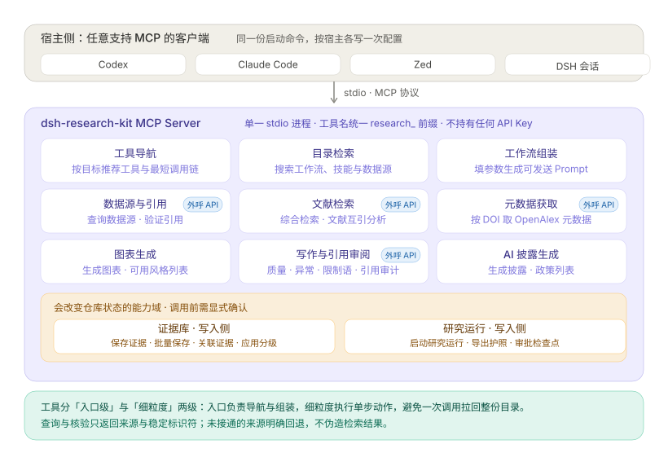

# MCP Server 跨平台配置指南

本文说明如何将 `dsh-research-kit` 的 MCP Server 接入 Codex、Claude Code、Zed 与 DSH 四种宿主。接入后，Agent 可以直接调用 31 个科研 Tool（文献检索、引用验证、证据管理、图表生成、写作质量检查、AI 披露生成等），不需要通过 UI 手动操作。

接进来能拿到什么，先看一张图：四类宿主连的是同一个 stdio 服务，工具按能力域分组；绝大多数只读或外呼，只有两个能力域会改变仓库状态，调用前需要显式确认。工具会同时暴露 MCP annotations（只读、外呼、幂等提示），业务错误统一带 `isError`，大结果默认使用紧凑 JSON。



> **从 9/18 之前的版本升级？** 14 个 Tool 已统一改名为 `research_` 前缀（例：`verify_citation` → `research_citation_verify`）。若你的宿主配置、脚本或提示词里写死了旧工具名，请按 [CHANGELOG](../CHANGELOG.md) 的「变更」首条更新——该条含完整的新旧名对照表。本包尚未发布到 npm，此前的安装都来自 git（本地目录或钉 commit）。

## 前置条件

| 依赖 | 版本 | 用途 |
|------|------|------|
| Node.js | >= 22.6 | 运行 MCP Server |
| npm | >= 10 | 安装依赖 |
| LaTeX（可选） | texlive / MacTeX | 生成图表脚本中的 `text.usetex` |

## 启动方式与本地数据

当前包尚未发布到 npm，请先使用本地克隆：

```bash
git clone https://github.com/fsrmqi/dsh-research-kit.git
cd dsh-research-kit
npm install
node mcp/server.js
```

可选环境变量：

| 变量 | 默认 | 用途 |
|------|------|------|
| `DSH_RESEARCH_KIT_HOME` | `~/.dsh-research-kit` | 证据库、护照、检查点与调用日志的数据根目录，可用于项目隔离或多实例并行 |
| `DSH_RESEARCH_KIT_CONTACT_EMAIL` | 空 | 作为 User-Agent 联系方式，并附加到 Crossref 请求的 `mailto` 参数 |
| `DSH_RESEARCH_KIT_CONFIRM_WRITES` | `required` | 设为 `disabled` 时跳过写入 elicitation；仅建议在宿主不支持 elicitation 的测试环境使用 |
| `DSH_RESEARCH_KIT_CONFIRMATION_TOKEN` | 空 | 宿主不支持 elicitation 时的回落确认令牌；写入工具传相同 `confirmation_token` 才放行 |

公开数据源还支持每源覆盖，`<SOURCE>` 可用 `CROSSREF`、`OPENALEX`、`SEMANTIC_SCHOLAR`、`EUROPE_PMC`、`ARXIV`、`CLINICALTRIALS`：

| 变量 | 默认 |
|------|------|
| `DSH_RESEARCH_KIT_SOURCE_<SOURCE>_TIMEOUT_MS` | `15000`，最大 `60000` |
| `DSH_RESEARCH_KIT_SOURCE_<SOURCE>_RATE_LIMIT` | `12`，最大 `120` |
| `DSH_RESEARCH_KIT_SOURCE_<SOURCE>_API_KEY` | 空；也兼容 `SEMANTIC_SCHOLAR_API_KEY`、`PUBMED_API_KEY` 等常见变量名 |

```bash
DSH_RESEARCH_KIT_SOURCE_SEMANTIC_SCHOLAR_TIMEOUT_MS=8000 \
DSH_RESEARCH_KIT_SOURCE_SEMANTIC_SCHOLAR_RATE_LIMIT=30 \
DSH_RESEARCH_KIT_SOURCE_SEMANTIC_SCHOLAR_API_KEY=your-key \
node mcp/server.js
```

## 写入确认

`research_evidence_save`、`research_evidence_save_batch`、`research_run_start`、`research_run_export`、`research_evidence_link`、`research_evidence_grade_apply` 和 `research_run_checkpoint_approve` 默认都会触发 MCP form elicitation。宿主接受并勾选确认后工具才执行；取消时返回 `CONFIRMATION_DECLINED`。宿主不支持 elicitation 时，可配置确认令牌作为受控回落。

```bash
DSH_RESEARCH_KIT_HOME=/path/to/data \
DSH_RESEARCH_KIT_CONTACT_EMAIL=you@example.com \
node mcp/server.js
```

以下配置示例统一假设仓库已克隆到 `/absolute/path/to/dsh-research-kit`。

---

## Codex

### Codex CLI

编辑 `~/.codex/config.toml`，添加：

```toml
[mcp_servers.dsh-research-kit]
command = "node"
args = ["/absolute/path/to/dsh-research-kit/mcp/server.js"]
```

### Codex Desktop

1. 打开 Codex Desktop -> Settings -> MCP Servers
2. 点击 Add Server
3. Name: `dsh-research-kit`
4. Command: `node`
5. Args: `/absolute/path/to/dsh-research-kit/mcp/server.js`
6. 保存并重启会话

### 验证

在 Codex 会话中输入：列出所有可用的 MCP 工具。Agent 应列出 31 个 dsh-research-kit 的 Tool。

---

## Claude Code

### 项目级配置

在项目根目录创建 `.mcp.json`：

```json
{
  "mcpServers": {
    "dsh-research-kit": {
      "command": "node",
      "args": ["/absolute/path/to/dsh-research-kit/mcp/server.js"]
    }
  }
}
```

### 全局配置

编辑 `~/.claude/claude_desktop_config.json`：

```json
{
  "mcpServers": {
    "dsh-research-kit": {
      "command": "node",
      "args": ["/absolute/path/to/dsh-research-kit/mcp/server.js"]
    }
  }
}
```

### 验证

在 Claude Code 中运行 `/mcp`，应看到 dsh-research-kit 状态为 connected。然后输入搜索审阅论文相关的工作流，Agent 应调用 research_catalog_search 并返回结果。

---

## Zed

在项目根目录创建 `.zed/settings.json`（或编辑全局 `~/.config/zed/settings.json`）：

```json
{
  "context_servers": {
    "dsh-research-kit": {
      "source": "custom",
      "command": "node",
      "args": ["/absolute/path/to/dsh-research-kit/mcp/server.js"]
    }
  }
}
```

保存后 Zed 会自动启动 MCP Server 进程。在 Assistant Panel 中可以查看已连接的 Tool。

### 验证

打开 Assistant Panel，输入：请验证 DOI 10.1038/s41586-020-2649-2 是否存在。Agent 应调用 research_citation_verify 并返回论文元数据。

---

## DSH（DeepSeek Harness）

dsh-research-kit 本身就是 DSH 插件。MCP Server 可以在 DSH 内以两种方式运行：

### 方式 1：DSH 插件内置（自动）

插件安装后，MCP Server 随 DSH 宿主自动可用。Agent 在当前会话中可以直接调用 MCP 工具，无需额外配置。

确认方式：在 DSH 会话中让 Agent 列出当前可用的 MCP 工具。如果看到 `mcp__dsh-research-kit__research_catalog_search` 等条目，说明已自动接入。

### 方式 2：独立进程（与 UI 并行）

如果 DSH 插件未安装（或你想在其他终端单独使用），在 DSH 的 MCP 配置中添加：

```json
{
  "mcpServers": {
    "dsh-research-kit": {
      "command": "node",
      "args": ["/absolute/path/to/dsh-research-kit/mcp/server.js"]
    }
  }
}
```

### UI + Agent 并行

DSH 的独特优势是 UI 和 MCP 同时可用：

- **UI 四分区**：人手动选工作流、拼 Prompt、发送，Agent 执行 prompt。
- **MCP Tool**：Agent 自主调用 research_catalog_search -> research_workflow_compose -> research_source_query，拿到结构化数据后自主推理。
- **Agent 活动面板**：人查看 Agent 的调用轨迹，在 checkpoint 处确认。

两种方式共享同一个 `catalog/` 目录和同一个证据存储（文件系统为真源，IndexedDB 为 UI 缓存）。

---

## 通用验证

无论哪个宿主，用以下流程验证 MCP Server 工作正常：

```text
1. 让 Agent 调用 research_catalog_search（query="审阅论文"）
   -> 应返回 review-paper 工作流条目

2. 让 Agent 调用 research_citation_verify（identifier="10.1038/s41586-020-2649-2"）
   -> 应返回 exists=true, title="Array programming with NumPy"

3. 让 Agent 调用 research_evidence_save（identifier_type="doi", identifier="10.1038/test", title="Test"）
   -> 应返回 saved=true

4. 让 Agent 调用 research_evidence_list
   -> 应包含刚才保存的条目
```

四步全部通过说明 MCP Server 与当前宿主的集成正常。

---

## Tool 清单速查

命名统一为 `research_<领域>_<动作>`：`catalog`（目录）、`workflow`（编排）、`source` / `metadata`（外部信息）、`evidence`（证据）、`run`（运行状态）、`review`（审阅）、`figure`（图表）、`disclosure`（披露）。日常审阅优先调用 `research_review_output`；需要深挖单一问题时，再调用对应的细粒度 `research_review_*` 工具。

不知道该调用什么时，先使用 `research_help`。它按自然语言目标返回推荐工具和最短调用链，本身不执行检索、写入或审批。

<!-- quick-start:start -->
**启动一次研究运行**
1. `research_catalog_search` — 参数示例：`{ query: '审阅论文', limit: 2 }`
2. `research_run_start` — 参数示例：`{ workflow_id: 'review-paper', project: 'demo', current_stage: 'literature_search' }`
3. `research_run_status` — 参数示例：`{ run_id: 'run-1a2b3c' }`

**检索并保存文献**
1. `research_literature_search` — 参数示例：`{ query: 'sleep deprivation memory', run_id: 'run-1a2b3c' }`
2. `research_evidence_save_batch` — 参数示例：`{ entries: [{ identifier_type: 'doi', identifier: '10.1038/xyz', title: '候选一' }], project: 'demo', run_id: 'run-1a2b3c' }`
3. `research_evidence_review` — 参数示例：`{ project: 'demo', run_id: 'run-1a2b3c', offset: 0, limit: 100, mode: 'summary' }`

**审阅研究草稿**
1. `research_review_output` — 参数示例：`{ text: '<草稿全文，至少100字>', run_id: 'run-1a2b3c' }`
2. `research_review_claims` — 参数示例：`{ text: '<含引用声明的段落>' }`

**生成论文图表**
1. `research_figure_list_styles` — 参数示例：`{}`
2. `research_figure_generate` — 参数示例：`{ style: 'nature', data_hint: '组间比较柱状图' }`

**恢复或推进运行**
1. `research_run_status` — 参数示例：`{ run_id: 'run-1a2b3c' }`
2. `research_run_checkpoint_approve` — 参数示例：`{ run_id: 'run-1a2b3c', stage: 'literature_search', note: '人工已确认' }`
3. `research_run_export` — 参数示例：`{ run_id: 'run-1a2b3c', current_stage: 'synthesis', workflow_id: 'review-paper' }`

**生成 AI 使用披露**
1. `research_disclosure_list_policies` — 参数示例：`{}`
2. `research_disclosure_generate` — 参数示例：`{ target_journal: 'Nature', ai_use_description: 'literature search and language editing' }`
<!-- quick-start:end -->

<!-- tool-table:start -->
| Tool | 功能 |
|------|------|
| `research_help` | MCP 工具导航：按目标推荐工具与最短调用链，不执行任何动作（默认入口） |
| `research_catalog_search` | 搜索科研工作流目录：按关键词、分类或标签筛选（默认入口） |
| `research_workflow_compose` | 填参数生成 Prompt（默认入口） |
| `research_source_query` | 直查 Crossref / OpenAlex / Semantic Scholar 等公开数据源 |
| `research_literature_search` | 默认文献检索入口：多源检索、去重、可选核验与显式证据保存（默认入口） |
| `research_citation_verify` | 验证 DOI / PMID / arXiv 是否存在 + claim 支持 |
| `research_evidence_save` | 保存证据条目（元数据，不存全文） |
| `research_evidence_list` | 检索已保存证据；默认摘要输出，支持分页与字段过滤 |
| `research_evidence_grade` | 实证 / 推论 / 缺失三级分级 |
| `research_evidence_review` | 默认证据盘点入口：只读汇总、建议分级、可追溯性风险识别；默认摘要输出并支持分页（默认入口） |
| `research_evidence_link` | 证据与资产互链 |
| `research_run_start` | 默认启动入口：创建研究运行、状态护照与人工检查点（默认入口） |
| `research_evidence_save_batch` | 默认批量保存入口：将检索结果中人工挑选的候选一次性显式保存（默认入口） |
| `research_evidence_grade_apply` | 预览→确认两段式写回建议分级；默认只预览，绝不自动写回 |
| `research_run_status` | 运行总览入口：一次汇总 run 阶段、检查点、证据盘点、最近产物与推荐下一步（默认入口） |
| `research_run_export` | 导出跨会话状态快照 |
| `research_run_import` | 导入状态快照恢复执行 |
| `research_run_checkpoint_status` | 查看管道检查点状态 |
| `research_run_checkpoint_approve` | 审批检查点继续执行 |
| `research_figure_generate` | 按论文风格生成 matplotlib 脚本（默认入口） |
| `research_figure_list_styles` | 列出全部可用的论文图表风格 |
| `research_review_output` | 默认审阅入口：聚合声明引用、异常、写作与限制语检查（默认入口） |
| `research_review_claims` | 文本级 claim-source 对齐审计 |
| `research_review_anomalies` | 检测冗余模式、矛盾表述与缺失要素 |
| `research_review_writing` | 学术写作质量检查（模糊术语、废话开头、标点、句长） |
| `research_review_hedging` | 检测保护性模糊限制语（不可静默删除） |
| `research_literature_link` | 发现证据间互引关系 |
| `research_disclosure_generate` | 按期刊 AI 政策生成合规的 AI 使用披露声明（默认入口） |
| `research_disclosure_list_policies` | 列出支持的期刊 AI 披露政策 |
| `research_metadata_openalex_fetch` | 通过 DOI 或检索词获取 OpenAlex 完整元数据；引用列表默认只返回数量，需显式开启才返回全量 |
| `research_usage_stats` | 工具使用可观测性：调用次数、失败率与链路中断位置（仅脱敏元数据） |
<!-- tool-table:end -->
