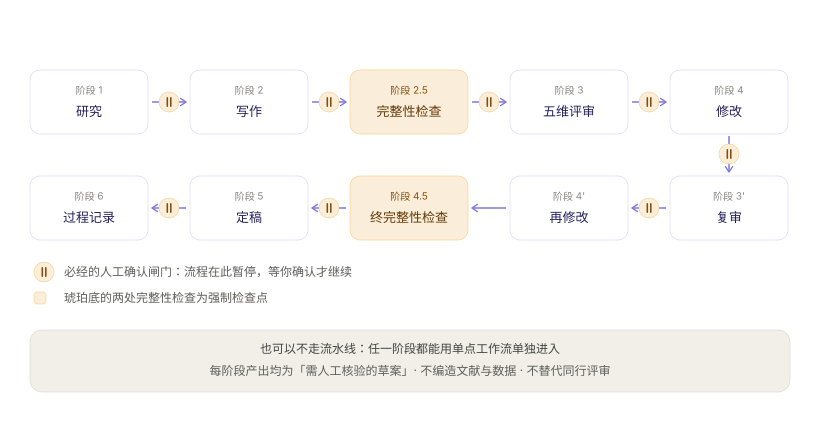

# 论文工作手册：写作、检索与投稿操作

> 这份文档只回答一个问题：**手上有一篇论文要写，在这个插件里该怎么走。**
> 想先看它是什么、要不要装 → [../README.md](../README.md)；想先划清它**不**做什么 → [PRODUCT.md](PRODUCT.md)。
> 想让 Agent 直接调 MCP 工具、不打开界面 → 直接看 §5。

## 0. 先选一条走法

三条走法共用同一套目录资产，区别只在「谁来把步骤串起来」。

| 你的情况 | 走法 | 起点 |
| --- | --- | --- |
| 只有主题或研究问题，从零开始 | 一键流水线：十阶段，阶段间有人工闸门 | 工作流 `paper-pipeline`，见 §4 |
| 已有材料或草稿，只卡在某一环 | 按阶段挑单点工作流，不必走完整链路 | §2 的九阶段表 |
| 想让 Agent 自己调工具，不打开界面 | MCP 路径：检索、核验、证据、图表、审阅 | §3 与 §5 |



## 1. 三个名词与两条前提

### 1.1 名词对齐

下面反复出现这三个词，先对齐含义，否则容易把「插件能做」和「Agent 能做」混在一起。

| 名词 | 是什么 | 不是什么 |
| --- | --- | --- |
| 工作流（workflow） | 一条参数化、可编辑的**提示词模板**，ID 形如 `paper-intake` | 不是可执行程序。启动后由**你自己的 DSH Agent** 执行，插件不调模型、不存密钥 |
| 技能条目（skill） | 勾选后作为「附加指导」段落**并入 Prompt 末尾**的提示词片段 | 不是插件替你执行的能力。它只是文本拼装 |
| 数据源（database） | 文献/临床/组学等来源的**元数据条目**，写明接入前提 | 不等于可访问。只有标 `available-in-plugin` 的能由插件直查，其余回退给 Agent 或 MCP |

### 1.2 两条操作前提

1. **声明了材料依赖的工作流，必须先给材料。** 入口是 DSH 原生 `@文件`——插件不读文件内容，只把引用写进 Prompt。论文类工作流里有的**声明了**材料依赖、启动时会提示；另有若干工作流的必填参数本身就是稿件路径（参数名 `paper_file`），此时你在该字段里填 `@文件` 引用的路径，效果相同。
2. **必填参数缺一不可。** 参数分必填与可选；可选留空会替换为「未指定（请按综合方式处理）」，不会留下 `{key}` 占位符。必填缺失时预览弹窗红框提示，且**不会写入草稿**。

## 2. 全流程：九个阶段

`论文与手稿` 与 `论文写作` 两个类目合计 36 条论文类工作流，其中 15 条声明了材料依赖。按研究推进顺序，它们覆盖九个阶段：

| 阶段 | 你要做的决定 | 工作流 | 需文件 |
| --- | --- | --- | --- |
| ① 配置 | 论文类型、学科、目标期刊、引用格式、输出格式、字数 | `paper-intake` | 否 |
| ② 检索 | 研究问题、纳入范围、要不要走系统综述 | `literature-search` · `literature-review` · `systematic-review-protocol` · `research-landscape` · `data-source-selection` | 否 |
| ③ 结构 | 选结构模板（IMRaD / 综述 / 理论 / 案例）、分节与字数配比 | `paper-structure` · `paper-plan-socratic` | 否 |
| ④ 论证 | 声明-证据链、反向论证怎么处理、声明强度对齐 | `paper-argument` | 否 |
| ⑤ 起草 | 整篇起草，还是按节补写、润色 | `paper-draft` · `write-full-manuscript` · `write-introduction` · `write-methods` · `write-results` · `write-discussion` · `write-abstract` · `edit-manuscript` | 多数为是 |
| ⑥ 核验 | 引用是否真实、声明是否越界、数据是否可追溯 | `paper-citation-check` · `paper-integrity` · `reference-check` · `claim-manifest-generate` · `experiment-provenance` | 多为是 |
| ⑦ 评审 | 谁来审、审多严、要不要魔鬼代言人 | `paper-review` · `review-paper` | 是 |
| ⑧ 返修 | 逐条回应，还是动结构、补实验 | `paper-revision-coach` · `manuscript-revision-plan` · `write-rebuttal` | 是 |
| ⑨ 投稿 | 目标期刊格式、AI 披露、投稿信、补充材料 | `paper-format` · `format-journal` · `translate-manuscript` · `cover-letter` · `write-cover-letter` · `disclosure-statement` · `submission-checklist` · `submission-readiness-check` · `paper-abstract` · `write-supplementary` | 多数为是 |

### 2.1 阶段①：先把规则定下来

`paper-intake`（论文配置面谈）先问清论文类型、学科、目标期刊、引用格式、输出格式、字数目标，产出**论文配置记录**，后面每一步引用它。只有 `topic` 必填——其余可以边走边补，但越早定，后面返工越少。字段 `writing_samples` 可指向你的旧作，用于风格校准。

阶段①有一个人工闸门：生成配置记录后**必须暂停等你确认**，不会直接往下走。

### 2.2 阶段②：检索（详见 §3）

`literature-search` 围绕主题检索并形成结构化书目；`literature-review` 进一步综合证据、识别争议与研究空白；`systematic-review-protocol` 按 PRISMA 规范设计**可注册**的方案；`research-landscape` 画领域主题、核心团队与趋势版图。

诚实边界（来自工作流自身的限制声明，不是你踩坑后才知道）：

- `literature-search`：**检索覆盖面取决于当前会话可用的检索工具**；未接通时结果仅基于模型已知文献，必须逐条核验。
- `systematic-review-protocol`：产出是**方案草案**，不等于已注册或已执行的综述；偏倚风险评估需方法学专家确认。
- `citation-analysis`：引用指标随数据源与日期变化，报告须注明来源与提取时间；**指标不等于质量**。
- `track-research-trends`：趋势外推是**推断**不是事实，发文量受数据库覆盖与检索式影响。
- `data-source-selection`：目录只标注接入前提，不保证你当前会话可访问；实际检索前需逐个确认工具可用性。

### 2.3 阶段③④：结构不是提纲，论证才是骨架

`paper-structure` 基于配置记录选结构模板、设计详细大纲、分配字数、建立论据映射。
`paper-argument` 在此之上构建**论证蓝图**：声明-证据链、逻辑流、反向论证处理、证据与声明强度的对齐。

`paper-plan-socratic` 是另一种风格：**只提问、不代答**，用苏格拉底式对话逼你把核心论点、节间逻辑和证据分配自己想清楚。它的三个闸门分别落在确认论点、确认结构、确认大纲三处。结构没想清楚时，用它比用前者更有价值。

### 2.4 阶段⑤：起草

两条路：

- **整篇**：`paper-draft` 按大纲和论证蓝图逐节写；`write-full-manuscript` 基于你已提供的材料组织 IMRAD 初稿与**待补充清单**。
- **单节**：`write-introduction` / `write-methods` / `write-results` / `write-discussion` / `write-abstract` 分别起草对应章节；`edit-manuscript` 只改语言，不动科学内容。

三条硬约束写在工作流里，不是建议：

- `write-methods`：缺失的实验细节会以「需补充」列出，**不得由模型推测补全**。
- `write-results`：**只报告材料中出现的数据**；结果解释属于讨论部分，不在本流程范围内。
- `edit-manuscript`：只修改语言表达；科学内容、数据与结论保持原样，**语义含糊处标注而非擅自改写**。
- `write-full-manuscript`：只能据已提供材料起草；缺失的数据、方法、引用或作者决策**逐项标注，不得补写**。

### 2.5 阶段⑥：核验——这一步不能省

论文类工作流里，核验与评审阶段的工作流多数带人工检查点。四个工具各管一件事：

| 工作流 | 核验什么 |
| --- | --- |
| `reference-check` | 引用真实性与格式，并**标记需要补引的论断**；无法确认的引用一律标记，不默认其真实 |
| `paper-citation-check` | 引用格式合规性、文献列表完整性、**DOI 有效性** |
| `paper-integrity` | 引用验证、实验声明对齐、AI 失败模式清单、数据声明检查 |
| `claim-manifest-generate` → `claim-manifest-verify` | 先给每条声明建立意图清单，再逐条验证，形成可追溯的闭环 |
| `experiment-provenance` | 把论文声称的实验结果与实际运行记录关联，验证每条实验声明的可追溯性 |

用 MCP 路径时，这一步可以交给 `research_citation_verify`（验证 DOI / PMID / arXiv 是否存在并检查是否支持对应 claim）与 `research_review_claims`（文本级 claim-source 对齐审计），逐条留痕。

### 2.6 阶段⑦⑧：评审与返修

`paper-review` 模拟**五席评审**：期刊匹配审稿人 + 方法学审稿人 + 领域审稿人 + 跨学科审稿人 + 魔鬼代言人，输出编辑决定信与修改路线图。魔鬼代言人的 CRITICAL 意见必须显式裁定——不能默默略过。

`paper-revision-coach` 解析真实审稿意见，生成结构化修改路线图，指导你逐条回应；`manuscript-revision-plan` 把审稿意见与现有稿件拆成可执行、可追溯的返修清单。后者的边界值得记住：**它不替作者决定是否新增实验、放弃主张或接受审稿意见**——争议项必须保留给你。

`write-rebuttal` 逐条写回复，需要作者决策的事项会明确列出而非代答。

### 2.7 阶段⑨：格式与投稿包

| 需要什么 | 工作流 |
| --- | --- |
| 按目标期刊调整结构与格式 | `format-journal` · `paper-format`（LaTeX / DOCX / PDF、模板适配、引用格式转换） |
| 中英双语摘要与关键词 | `paper-abstract` |
| 稿件翻译（保术语与数据精确） | `translate-manuscript` |
| 投稿信 | `cover-letter` · `write-cover-letter` |
| AI 使用披露声明 | `disclosure-statement`（按目标期刊 AI 政策生成） |
| 补充材料 | `write-supplementary` |
| 投稿前逐项核对 | `submission-checklist` · `submission-readiness-check` |
| 过程记录与溯源 | `process-summary-generate` · `experiment-provenance` |

两条边界照实说：`format-journal` **无法核验的投稿要求会明确列出**，需你向期刊确认；`write-cover-letter` 的推荐审稿人**须由作者确认无利益冲突后决定**。

## 3. 检索：三条查询路径

同一次文献检索，按你手上的工具不同走三条路。它们的**核心差别不是覆盖面，而是结果能不能核验**。

### 3.1 路径 A：插件直查（在界面里操作）

文献研究类目另有 16 条工作流、19 个数据源条目。其中 5 个来源由插件内置适配器**直接查询**：PubMed、Crossref、OpenAlex、Semantic Scholar、Europe PMC；其余一律标注接入前提（需要 MCP、订阅、API Key 或数据使用协议）。

操作：打开数据源详情页 → 状态显示「插件可直接查询」→ 输入检索词 → 候选结果带**来源链接与稳定标识符**（DOI / PMID / arXiv）→ 写入输入框，或点「让 Agent 核验并继续查询」。

文献类可直查来源（描述取自目录条目本身）：

| 来源 | 目录里的定位 |
| --- | --- |
| PubMed | 生物医学与生命科学文献数据库 |
| Europe PMC | 生命科学文献库：论文、专利与预印本 |
| Crossref | 学术作品的 DOI 元数据：期刊、图书、数据集 |
| OpenAlex | 开放学术元数据目录：论文、作者、期刊、机构及其关联 |
| Semantic Scholar | AI 增强的学术论文检索、引用与推荐 |

目录标注与查询实现由 `npm run check` 双向校验——有适配器就必须标出来，标了就必须有适配器，因此界面上的能力状态不会与实现漂移。**插件不会伪造任何检索结果。**

### 3.2 路径 B：MCP 工具（Agent 调用，不打开界面）

| 工具 | 用途 | 是否需确认 |
| --- | --- | --- |
| `research_help` | 按目标推荐工具与最短调用链，**不执行任何动作** | 否 |
| `research_literature_search` | 默认文献检索入口：多源检索、去重、可选核验与显式证据保存 | 否 |
| `research_source_query` | 直查 Crossref / OpenAlex / Semantic Scholar 等来源 | 否 |
| `research_metadata_openalex_fetch` | 按 DOI 或检索词取 OpenAlex 完整元数据，可选存入证据库 | 否 |
| `research_citation_verify` | 验证 DOI / PMID / arXiv 是否存在 + claim 支持 | 否 |
| `research_literature_link` | 发现已保存证据之间的互引关系 | 否 |
| `research_evidence_save_batch` | 把你**人工挑选**的候选一次性显式保存到证据库 | **是** |
| `research_evidence_review` | 只读盘点：汇总、建议分级、识别可追溯性风险 | 否 |
| `research_evidence_grade_apply` | 预览→确认两段式写回建议分级，默认只预览 | **是** |

### 3.3 路径 C：Agent 回退

工作流详情页的「让 Agent 核验并继续查询」按钮会调用**当前 DSH 会话的 Agent**，由它使用自己已拥有的 Web / MCP / 文件工具完成多步检索。这条路没有固定的覆盖面——**取决于你的会话装了什么**，所以结果必须逐条核验。

### 3.4 检索结果怎么沉淀

检索到的东西有两种去处，别混用：

- **证据库**：显式「保存到证据库」的条目，带稳定标识符，按项目隔离去重，默认「未核验」，可导出 / 导入 JSON。**只保存来源元数据与你写下的笔记，不保存全文与检索词。**
- **工作台内存索引**：本会话已启动工作流与直查来源的摘要，仅供图谱实时成图，刷新即清空。

只有在你**显式开启「自动沉淀」**后，助手回答中引用的来源才会以「未核验」状态自动入库并带标签——默认关闭，且不会静默注入。

## 4. 一键流水线：十阶段与八个人工闸门

`paper-pipeline` 把上面九阶段压成一条链：研究 → 写作 → 完整性检查 → 五维评审 → 修改 → 复审 → 再修改 → 终完整性检查 → 定稿 → 过程记录。

必填参数只有 `topic`，另有一个 `entry_stage` 决定从哪进去：

| 你的状态 | 入口 |
| --- | --- |
| 只有主题 | 从阶段 1（研究）开始 |
| 已有研究材料 | 从阶段 2（写作）开始 |
| 已有论文草稿 | 从阶段 2.5（完整性检查）开始 |
| 已收到审稿意见 | 从阶段 4（修改）开始 |

**每阶段完成后必须暂停等你确认才能继续**（工作流里写作 IRON RULE）。两处完整性检查与两个评审决定是 MANDATORY 检查点，不可跳过。修改循环最多 2 轮。

不想走整条链，就回 §2 挑单点工作流——同一套资产，两种粒度。

## 5. 操作层：MCP 最短调用链

### 5.1 从「我想写论文」到「有人在等我确认」

```
research_help                    ← 不确定从哪开始就问它（不执行动作）
  → research_catalog_search      ← 按关键词/分类找 workflow id
  → research_workflow_compose    ← 填参数生成 Prompt，并拿到限制、建议技能/来源、检查点
  → research_run_start           ← 创建研究运行 + 状态护照 + 初始化检查点【需确认】
     → research_run_checkpoint_status   ← 看哪个闸门在等
     → research_run_checkpoint_approve  ← 人工审批后继续【需确认】
  → research_run_status          ← 一次汇总阶段、检查点、证据盘点、最近产物、推荐下一步
  → research_run_export / import ← 导出/导入护照，跨会话恢复【导出需确认】
```

`research_workflow_compose` 的返回里有两项**只在这条路径上出现**的东西：`agent_guidance`（告诉 Agent 该调用哪些工具、用何种标注分级）与 `checkpoints`（该工作流的必经闸门）。

界面路径不会创建研究运行，因此没有检查点——界面侧的「Agent 活动面板」展示的是 **MCP 侧创建的运行**的调用轨迹，并在闸门处等你确认。

### 5.2 需要显式确认的写操作

插件把「读」和「写」分得很开，工具按访问级别分三类：**只读**、**外呼学术 API**（不改本地状态）、**写本地状态**。第三类有一条不变量——**凡是会改动本地状态的工具都要求人工确认，没有例外**，不会静默执行：

| 工具 | 写什么 |
| --- | --- |
| `research_run_start` | 创建研究运行与护照 |
| `research_run_checkpoint_approve` | 审批检查点，放行下一步 |
| `research_run_export` | 导出状态快照 |
| `research_evidence_save` / `research_evidence_save_batch` | 写入证据库条目 |
| `research_evidence_grade_apply` | 写回证据分级 |
| `research_evidence_link` | 建立资产-证据互链 |

这张表就是全部——注册表里没有任何一个「写但不问」的工具。

### 5.3 写作与审阅侧的辅助工具

| 工具 | 用途 |
| --- | --- |
| `research_review_output` | 默认审阅入口：聚合声明引用、异常、写作与限制语四项检查 |
| `research_review_writing` | 学术写作质量检查（模糊术语、废话开头、标点、句长） |
| `research_review_hedging` | 检测保护性模糊限制语——**不可静默删除** |
| `research_review_anomalies` | 冗余模式、矛盾表述与缺失要素 |
| `research_figure_generate` | 按论文风格生成 matplotlib 脚本 |
| `research_disclosure_generate` | 按期刊 AI 政策生成合规披露声明 |
| `research_disclosure_list_policies` | 列出支持的期刊 AI 披露政策 |

插件同时提供 32 个 `research_*` 工具，宿主清单、接入步骤与按任务组织的最短路径见 [MCP-SETUP.md](MCP-SETUP.md)。

## 6. 四条硬边界

1. **不编造。** 不得虚构引用、数据、页码、作者意图或文件路径；无法确认的一律标注为待核验。所有工作流产出一律标注为**需人工核验的草案**。
2. **不替代同行评审、伦理审批与统计咨询。** 模拟评审是自查工具，不是审稿意见；系统综述方案不等于已注册的综述。
3. **不替你决策。** 是否新增实验、是否放弃某条主张、是否接受某条审稿意见、推荐谁当审稿人——这些必须由作者决定，工作流的职责是**把争议项明确列出来**。
4. **不自动发送、不上传材料。** 快捷入口只写草稿，从不自动发送；`@文件` 只把引用写进 Prompt，插件不读取、不上传、不解析文件内容。零遥测。

## 7. 常见问题

**只有摘要或二手转述，能用吗？**
`summarize-paper` 与 `compare-papers` 只处理你**实际提供**的论文，不可直接比较之处（人群、终点、方法不同）会明确标注。二手材料不能补成事实。

**检索结果是可信的吗？**
结果本身只保证「来源可查」，不保证「支持你的论点」。可信度来自阶段⑥的逐条核验：`research_citation_verify` 查标识符是否存在并是否支持对应 claim。**检索与核验是两步，不是一步。**

**能找到全文或帮我下载文献吗？**
不。插件与 MCP 工具返回的是**元数据、标识符与来源链接**，证据库也明确不保存全文。

**中文论文怎么办？**
`paper-abstract` 出中英双语摘要并提取关键词；`translate-manuscript` 在有原文的前提下翻译，术语按目标领域惯例，译文须对照原文核验。

**投稿前还差什么？**
跑 `submission-readiness-check` 或 `submission-checklist`：覆盖稿件、图表、作者信息、报告规范与待确认事项。它们**不替代期刊投稿系统或作者最终声明**，无法核验的期刊规则会标注出来。

**为什么流水线总停下来等我？**
那是设计。研究类任务里，跳过核验的成本远高于确认一次的成本——闸门就是防止「一路自动生成到投稿」。

---

## 附：本页事实的来源

本页所有工作流 ID、参数名、文件依赖、限制声明与检查点，均取自 `catalog/workflows/`（以 `paper-manuscript.json`、`paper-writing.json`、`submission.json`、`literature.json`、`advanced.json` 为主）；工具名、访问级别与确认要求取自 `mcp/tool-registry.js`；数据源可用性取自 `catalog/resources/`。规模数字由 `npm run check` 的 `scripts/check-doc-stats.mjs` 与实测比对。

目录条目会随版本变化，本页的清单请配合界面或 `research_catalog_search` 使用。
