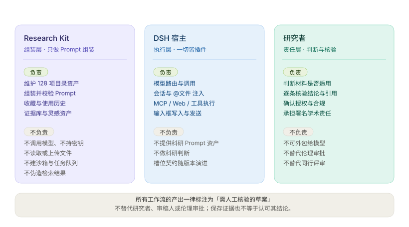

# 产品范围与边界

本文说明 `dsh-research-kit` 要解决的问题、产品定位与边界、资源模型与质量原则。**描述的是当前状态**，不是待执行的计划；未完成事项集中记录在根目录 [ROADMAP.md](../ROADMAP.md)。

用户向的安装与使用说明见根目录 [README](../README.md)，技术架构见[架构与数据契约](ARCHITECTURE.md)。

## 1. 要解决的问题

通用聊天输入适合临时提问，却不适合反复执行有明确步骤、材料要求与质量边界的科研任务。例如论文审阅、撰写引言、文献综述、格式化期刊投稿稿件或设计分析计划，往往需要：

- 明确输入材料、研究对象和输出范围；
- 使用可复查的步骤，而不是一句笼统指令；
- 在模型执行前让研究者看见、编辑并确认任务说明；
- 提醒模型核验文献、数据、引用和不确定性，而非编造结论。

本插件提供的是**任务启动体验与高质量提示词资产**，不是独立的科研执行后端。模型调用、工具执行、文件读取全部由当前 DSH 会话承担。

## 2. 产品定位与边界

### 做什么

```text
科研能力目录（525 项）
  → 选择工作流
  → 填写参数、用 @文件 引用材料
  → 预览并编辑最终 Prompt
  → 写入输入框 或 发送到当前 DSH 会话
  → 由 DSH 中的 Agent 和其已配置工具执行
```

- 提供"工作流程、技能、数据库"三类可搜索资源；
- 将工作流组装为可编辑 Prompt；
- 使用 DSH 原生 `@文件` 引用，不复制文件上传、沙箱或文件浏览器；
- 复用当前 DSH 会话的模型和工具能力；
- 可将用户常用工作流收藏在浏览器本地。

### 不做什么

- 不声称内置或自动接通外部学术数据库；
- 不实现自带模型路由、成本账本、持久任务队列或沙箱的独立 Agent 运行时；
- 不将模型输出自动认定为证据、可复现结果或经同行评审的结论；
- 不绕过 DSH 的模型、权限、MCP 或文件引用机制。

「数据库」和「技能」条目本质是**可见的元数据与提示词指导**。122 个数据源中有 11 个由插件内置适配器直接查询（目录状态标记为 `available-in-plugin`），其余 111 个如实标注接入前提——需要 MCP、订阅、API Key 或数据使用协议——并显式回退到当前会话的 Agent。**无论走哪条路径，插件都不会伪造检索结果。**


## 3. 用户体验

统一视图内部按「发现 → 构造 → 沉淀 → 证据」组织，四个分区共享同一套防编造与人工核验纪律：


### 3.1 科研能力目录（统一视图 · 分区①）

在 DSH 的 `conversation.view` 中提供「科研工作台」统一视图，其第一个分区即科研能力目录：

- 顶部：关键词搜索，可匹配名称、描述、标签、学科和模板正文；
- 筛选：全部 / 工作流程 / 技能 / 数据库 / 收藏 / 历史；
- 左栏：按学科分组的资源清单，展示类型、名称、简述和"需要材料"标记；
- 右栏：选中资源的详情、参数、提示词模板和关联资源；
- 窄屏：列表与详情切换显示，而非并排挤压。

学科覆盖六类：论文与手稿、文献研究、基因组学、临床研究、数据分析、研究设计。目录规模以质量优先，不以数量为目标。

### 3.2 工作流启动弹窗

选择工作流后打开启动弹窗，流程为：

1. 展示名称、目的、适用范围和所需材料；
2. 填写必需/可选参数；
3. 对需要材料的流程，提醒用户通过 DSH 原生 `@文件` 引用相关文件；
4. 实时生成 Prompt 预览，并允许直接编辑；
5. 显示建议技能、数据库和使用限制；
6. 用户选择“写入输入框”或“发送到当前会话”。

“发送”只调用 DSH 当前会话已有的发送能力；插件不得自行创建模型路由或保存 API Key。

### 3.3 代表性工作流：审阅论文

`审阅论文` 是首期的标杆流程。它要求用户引用论文材料，并生成包含以下边界的 Prompt：

- 先确认审阅范围与保密、利益冲突等阻塞条件；
- 逐项评估研究问题、设计、统计、局限性、可重复性和图表/引用一致性；
- 将“材料未报告”与“方法学不足”区分开；
- 每条批评关联可定位的材料位置；
- 不编造页码、图表、数据、引用、作者意图或结论；
- 以“需人工核验的审阅草案”形式输出。

本项目的口径是：工作流主要是参数化 Prompt；文件材料与模型选择是启动条件；真正的执行由当前 Agent 通过可用工具完成。

## 4. 资源模型

统一资源模型便于目录筛选和关联，但每种类型有自己的字段。

```ts
type CatalogItem = Workflow | ResearchSkill | ResearchDatabase

type BaseItem = {
  id: string
  type: 'workflow' | 'skill' | 'database'
  name: string
  description: string
  category: string
  tags: string[]
  relatedIds?: string[]
}

type Workflow = BaseItem & {
  type: 'workflow'
  prompt: string
  placeholders: Array<{
    key: string
    label: string
    required: boolean
    multiline?: boolean
    hint?: string
  }>
  requiresFiles?: boolean
  suggestedSkillIds?: string[]
  suggestedDatabaseIds?: string[]
  limitations?: string[]
}

type ResearchSkill = BaseItem & {
  type: 'skill'
  guidance: string
  promptFragment?: string   // 勾选后以「附加指导」并入 Prompt 末尾；requires-host-capability 条目不得携带
  checklist?: string[]      // 指导模块=人工检查清单；需宿主能力=使用前提核验清单
  availability: 'prompt-guidance' | 'requires-host-capability'
}

type ResearchDatabase = BaseItem & {
  type: 'database'
  accessNote: string
  url?: string              // 接口地址，详情页展示
  availability: 'reference-only' | 'requires-mcp' | 'available-in-host'
}
```

Prompt 中的参数使用 `{topic}` 这种显式占位符。启动器只替换声明过的占位符；所有必填值未填写时，禁用“发送到当前会话”。用户编辑 Prompt 后，以编辑后的版本为准。

示例：

```json
{
  "id": "review-paper",
  "type": "workflow",
  "name": "审阅论文",
  "description": "审查方法、统计严谨性、局限性并形成建设性反馈。",
  "category": "论文与手稿",
  "tags": ["同行评审", "方法学", "统计"],
  "requiresFiles": true,
  "placeholders": [
    {
      "key": "focus",
      "label": "重点审查方向",
      "required": false,
      "hint": "留空时进行综合审阅"
    }
  ],
  "suggestedSkillIds": ["scientific-writing", "statistics-review"],
  "suggestedDatabaseIds": ["crossref"],
  "prompt": "请审阅用户通过 @文件 引用的论文。重点方向：{focus}。先确认材料与审阅范围；仅依据已提供材料提出可定位、可核验的意见，不得编造数据、引用、页码或作者意图。"
}
```

## 5. 与 DSH 的集成边界

| 需求 | 接入方式 | 说明 |
| --- | --- | --- |
| 工作台页面 | `conversation.view` | 统一容器，内部分四个二级分区。 |
| 输入框快捷入口 | `conversation.input.left` + `conversation.input.overlay` | 工具行「资源 / 工作流程」按钮与上方弹层选择器。 |
| 草稿增强 | `conversation.input.right` | 输入框旁的增强入口（order 80，低于宿主发送控件）。 |
| 当前草稿 | `useInput` / `inputActions` | 最终 Prompt 可写入输入框，保留用户再次编辑的机会。 |
| 发送任务 | `inputActions.submit()` | 只经宿主当前会话发送。 |
| 文件材料 | DSH 原生 `@文件` | 插件只提示使用该能力，不重复上传功能、不读取文件内容。 |
| 研究记忆（未实现） | Memory Center HTTP 接口 | 必须先检索、预览并由用户确认后才注入 Prompt。 |
| 外部数据库 | DSH MCP / 宿主工具，或受控直查路由 | 未接通时展示访问前提，不得宣称已经检索。 |

`conversation.view` 与 `inputActions` 的契约随 DSH 版本演进，因此每次升级都必须按[手工验收清单](MANUAL-QA.md)在真实 profile 复验；宿主 props 变更只改 `dsh/standalone-glue.js`。

## 6. 实施状态

各阶段的开放项与后续方向集中记录在根目录 [ROADMAP.md](../ROADMAP.md)。以下是当前状态摘要。

### 已完成

- **目录与启动器**：525 项资源（317 工作流 + 86 技能 + 122 数据源，按流程族/用途分片维护）、参数替换、Prompt 预览/编辑、写入/发送、`@文件` 材料提醒、资源关联与不可用能力提示；
- **本地偏好**：收藏与使用历史（`CatalogStorage` 接口隔离 `localStorage`）；
- **统一视图四分区**：资源与工作流 / 方法工坊 / 研究资产库（含「灵感资产 / 证据库」两个子模块）/ 研究证据图谱，分区契约由测试守护；
- **公开数据源直查**：首批 11 个来源的适配器、结果缓存与速率预算、Agent 查询回退；
- **方法工坊与草稿增强器**：方法卡库、变量填充、从对话提取草稿、轻量档与语义档增强（详见 [METHOD-WORKSHOP.md](METHOD-WORKSHOP.md)）；
- **真实 profile 验收**：两轮启动烟测全部通过；证据库写入 Prompt（§4c）与证据图谱接入（§4d）的现场验收亦已通过（见 [MANUAL-QA.md](MANUAL-QA.md)）；
- **研究证据库（ROADMAP §4a–4c）**：公开来源逐条保存、稳定标识符自动识别、IndexedDB 持久化（无 IndexedDB 时降级为内存并显式提示）、核验状态默认为「未核验」且可逐条推进；按项目隔离与切换（当前项目跨会话保留）、同一标识符在同项目内去重（命中重复由用户裁决覆盖或另存）、单条与按项目彻底删除、按项目导出与增量导入；勾选条目后把带来源链接与「尚未经逐条核验、不得据此直接断言结论」边界的引用块写入当前 Prompt（未选择不注入；勾选是跨筛选状态，调整检索词或筛选条件不会撤销已选条目；宿主未提供输入框操作时按钮禁用、引用块转为手工复制）。入口在查询结果条目，列表在沉淀层分区的「证据库」子模块。
- **证据图谱接入（ROADMAP §4d）**：已保存证据作为独立节点接入图谱，节点展示来源库、稳定标识符与核验状态，**不携带笔记、全文或检索词**；证据按来源库连到同库资源节点，并按 URL 或稳定标识符匹配本会话查询来源，工作流经资源节点形成可追溯链路；箭头按两端节点实际位置选择锚点，逆向关系不再固定「左进右出」。图谱对证据库是只读接入（不写入、不修改）。
- **专用证据图谱 Viewer（ROADMAP §3.1）**：图谱具备确定性分层布局与端口路由；Ctrl / ⌘ 滚轮缩放、拖拽平移与复位，迷你地图点击跳转；聚焦 / 上游 / 下游 / 两点路径四种范围模式（路径忽略箭头方向求最短路，非范围内节点降透明度保留参照）；`prefers-reduced-motion` 时链路流动动画自动关闭；视图链接只编码焦点、范围与缩放，**不编码任何证据内容**；用户显式触发的脱敏 SVG / HTML 快照导出，导出弹窗与导出文件正文都写明元数据范围（仅含节点标题、来源库、稳定标识符、核验状态与关系，不含笔记、全文、检索词、附件或草稿）。

### 未完成

- Memory Center 项目记忆检索（确认式注入）；
- 宿主能力探测，用于按实际 MCP / 工具可用性标注数据源与技能；
- 宿主动作缺失降级的**交互级**自动化测试：五处守卫已覆盖到渲染级初始状态（`test/render-smoke.test.js`：按钮禁用态、降级文案、不抛错）与源码接线契约，但「点击后不注入」的交互级断言仍需真实 DOM 事件运行时（见 [ROADMAP §1](../ROADMAP.md)）；
- 发送前自动增强（依赖宿主下发钩子）。

## 7. 质量与安全原则

- **证据有出处：** Prompt 应要求模型区分已提供材料、可验证外部来源和推断。 
- **不编造：** 不允许虚构文献、数据、统计结果、材料定位或研究结论。 
- **保密优先：** 涉及未公开论文、患者数据或受限数据时，必须提示用户确认授权与适用政策。 
- **人类决策：** 工作流生成草案、建议和待核验发现，不替代研究者、审稿人或伦理审批。 
- **能力如实呈现：** 目录项标注的是建议或接入前提，不能被展示成已实际执行的工具调用。 
- **最小数据暴露：** 默认复用当前 DSH 会话与原生文件引用；不额外采集、上传或遥测。 



## 8. 目录结构

实际目录结构以 [架构与数据契约](ARCHITECTURE.md) 第 2 章为准；该章同时约束各分层的职责边界（哪些层可以访问 DOM、网络或宿主 API）。
